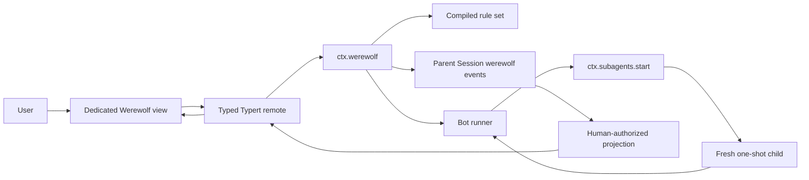

# Agent Note: Configurable single-player Werewolf mode

Status: proposed

English | [中文](2026-08-20-configurable-werewolf-mode.zh.md)

## Problem

DeepSeek Harness can start several subagents, but it has no game runtime that lets one user play a complete hidden-role game against model-backed bots. Treating the parent agent as the moderator would put authoritative rules, secret distribution, legal-action checks, and victory evaluation behind model output. A model mistake could then change game state or reveal information.

A fixed seven-player implementation would prove the interaction but would make every additional role an engine change. Werewolf variants differ in deck composition, phase order, role options, action resolution, tie policy, and victory conditions. The runtime needs configuration that selects registered mechanics without admitting executable code or an expression language in `cordis.yml`.

Fresh one-shot subagents provide the right isolation and structured-result contract for individual decisions, but a fresh transcript alone loses a bot's direction between decisions. The same logical bot must retain its subjective beliefs, public commitments, current strategy, and recent decision summary across independent runs. That continuity state must remain separate from authoritative game truth and from unrestricted chain-of-thought text.

## Proposal

Add an optional Werewolf bundle whose Host runtime owns a deterministic, event-sourced game. One parent Session contains the game events and acts as the lineage parent for bot runs. A dedicated Web game view calls the runtime through typed Typert methods, so ordinary game input does not invoke the parent model or pass through the Chat composer.

Each seat has one durable logical `BotActor`. Every bot decision starts a fresh one-shot child through `ctx.subagents.start()`, using a complete authoritative observation plus that bot's latest `BotContinuityContext`. The child returns a phase action and a bounded `BotContextDelta` under an object-rooted JSON Schema. The runtime validates both, computes the next context, and appends the accepted action, delta, and full resulting context in one `werewolf/bot-decision` event. A later decision for that actor always starts from the latest accepted context revision.

Rules are configuration over trusted registries. A rule set names registered role types, phase types, and victory-condition types and supplies their validated options. Adding a registered role to a deck is configuration-only. Adding a role with new mechanics requires a plugin that registers the role and any new phase implementation, after which rule sets can use it without changing the core engine. Configuration never contains JavaScript, selectors, callbacks, or an expression language.

The feature extends the documented Session-event, subagent, Typert remote, and `conversation.view` mechanisms rather than changing `agent-loop`. Session events are the durable facts, the Web Client owns the game interaction surface, and fresh `spawn` children support persona, tool filtering, depth limits, and structured output; see [the architecture map](../../../docs/architecture.md), [the subagent contract](../../../docs/subsystems/subagent.md), and [the Web Client architecture](../../../packages/client/README.md).

## Scope and non-goals

Version 1 includes one human, configurable bot seats, configurable rule sets, registered role and phase extensions, deterministic phase resolution, replay and resume, and a dedicated responsive Web game view. The shipped classic plugin supplies villager, wolf, seer, and witch definitions plus a `quick-7` rule set.

Version 1 does not provide online multiplayer, adversarial anti-cheat, voice chat, generated role code, arbitrary configuration expressions, long-lived bot subagent conversations, or a model moderator. Sheriff elections, hunter shots, guards, special victory rules, and other roles are admitted through the extension contracts but need not ship in the first implementation.

The parent agent remains an ordinary live `Agent` because the subagent service requires an exact parent and the Session owns durable game events. The parent model is not asked to interpret game input, validate actions, summarize bots, or decide outcomes.

## Runtime architecture



`WerewolfRuntime` is a concrete Cordis service, not a new capability seam. It owns the game controller and four extension registries: rule sets, roles, phases, and victory conditions. Registrations are effects and duplicate identifiers at one version fail during registration. The runtime depends only on Service Definitions such as `dsh-subagent`, `dsh-session`, and `dsh-agent`, never on a concrete subagent provider package.

The optional composition bundle mounts the concrete `spawn` provider, the Werewolf runtime, classic definitions, the Host remote, and the Web Client plugin. Another profile may select a different provider only when it advertises `outputSchema`, `persona`, `toolFilter`, and `depthLimit`; game start fails before appending `werewolf/game-started` when any required capability is absent.

## Configurable rules

### Rule-set input

The Cordis plugin config carries one or more JSON-compatible `WerewolfRuleSetInputV1` records. The input keeps defaults unresolved. `resolveRuleSet()` is the only operation that applies explicit defaults, resolves registry references, validates cross-field invariants, and returns an immutable `CompiledWerewolfRuleSetV1`.

```ts ignore-check
interface WerewolfRuleSetInputV1 {
  schemaVersion: 1
  id: string
  revision: number
  displayName: string
  playerCount: number
  deck: Array<{
    role: string
    count: number
    options?: JsonValue
  }>
  cycle: {
    setup?: Array<{ phase: string; options?: JsonValue }>
    night: Array<{ phase: string; options?: JsonValue }>
    day: Array<{ phase: string; options?: JsonValue }>
  }
  victory: Array<{
    condition: string
    options?: JsonValue
  }>
  policies: {
    voteTie: 'no-elimination' | 'revote-once' | 'seeded-random'
    wolfTie: 'no-kill' | 'seeded-random'
    deadHuman: 'spectate' | 'auto-advance'
    maxDays: number
    speechMaxChars: number
  }
}
```

`schemaVersion` versions the configuration fields. `revision` versions one named rule set. The pair `{ id, revision }` is immutable after registration. The config parser rejects unknown keys, unsafe integers, empty decks, non-positive counts, duplicate phase occurrences that the phase type does not declare repeatable, and policy values outside the closed unions.

The compiled rule set must satisfy all of these conditions:

- deck counts sum exactly to `playerCount`;
- every role, phase, and victory-condition identifier resolves to one registered definition;
- every options value passes the owning definition's parser;
- every phase requirement is satisfiable by at least one role in the deck unless the phase explicitly allows an always-skipped result;
- at least one victory condition is present, and two conditions cannot return conflicting winners at the same configured priority;
- every public label and every model-visible limit is bounded by plugin configuration; and
- the normalized rule set is plain JSON and has a stable SHA-256 digest.

Game start stores the complete normalized rule set, digest, engine event version, and referenced definition versions in `werewolf/game-started`. Editing Cordis config affects only later games. Resume and fork use the recorded snapshot; they never reinterpret an active game through a newer deployment rule set. If the current runtime lacks a recorded definition version, resume fails with a typed unsupported-definition error and leaves the log unchanged.

### Extension definitions

The core publishes trusted same-process registration types. Definitions parse their own options and return detached JSON data; they never receive a mutable `GameState` reference.

```ts ignore-check
interface WerewolfRoleDefinition {
  id: string
  version: number
  parseOptions(value: JsonValue | undefined): JsonValue
  compile(input: {
    options: JsonValue
    ruleSet: CompiledRuleSetSummary
  }): CompiledWerewolfRole
}

interface CompiledWerewolfRole {
  id: string
  version: number
  faction: string
  publicName: string
  initialRoleState: JsonValue
  projectPrivateKnowledge(input: RoleKnowledgeInput): JsonValue
}

interface WerewolfPhaseDefinition {
  id: string
  version: number
  repeatable?: boolean
  parseOptions(value: JsonValue | undefined): JsonValue
  compile(input: {
    options: JsonValue
    roles: readonly CompiledWerewolfRole[]
  }): CompiledWerewolfPhase
}

interface CompiledWerewolfPhase {
  id: string
  version: number
  open(input: PhaseOpenInput): PhaseOpenResult
  resolve(input: PhaseResolveInput): PhaseResolution
}

interface WerewolfVictoryConditionDefinition {
  id: string
  version: number
  parseOptions(value: JsonValue | undefined): JsonValue
  evaluate(input: VictoryEvaluationInput): GameResult | null
}
```

`PhaseOpenResult` is either `skip` or an immutable action plan. The action plan lists actors, execution mode (`parallel-private` or `seat-order-public`), bot action JSON Schema, optional human form fields, legal targets, and visibility. `PhaseResolution` contains declarative eliminations, prevention records, resource replacements, role-state replacements, private knowledge notices, public announcements, and vote records. The core applies those records in a fixed order and rejects references to an unknown game, player, phase, action, or role-state owner.

A new role that only changes deck count or registered options needs a rule-set config change. A new role that participates in an existing phase registers a role definition and uses that phase's supported options. A role with a new action window registers both a role definition and a phase definition, then adds that phase to the configured cycle. A new victory mechanic registers a victory-condition definition. None of these changes modifies the core phase loop.

### Classic rule set

The classic plugin supplies this normalized intent; exact display copy remains package-owned and localized rather than embedded in the rule record.

```yaml
schemaVersion: 1
id: quick-7
revision: 1
displayName: Quick 7-player game
playerCount: 7
deck:
  - role: wolf
    count: 2
  - role: seer
    count: 1
  - role: witch
    count: 1
    options:
      antidoteUses: 1
      poisonUses: 1
      selfSave: first-night-only
  - role: villager
    count: 3
cycle:
  night:
    - phase: night.wolf-kill
    - phase: night.seer-inspect
    - phase: night.witch
  day:
    - phase: day.announce
    - phase: day.discussion
    - phase: day.vote
victory:
  - condition: faction-elimination
  - condition: wolf-parity
policies:
  voteTie: revote-once
  wolfTie: seeded-random
  deadHuman: spectate
  maxDays: 8
  speechMaxChars: 160
```

## Game lifecycle and scheduling

One Session may have at most one active game. A finished or aborted game remains in the log, and a later `start` creates a new `GameId`. Forking a Session creates an alternate game timeline in the forked Session; it does not join or mutate the source Session's game.

The runtime serializes every state-changing operation for one live Agent. Each external request carries an idempotency id and `expectedGameRevision`. The runtime first returns the prior result for a repeated id, otherwise rejects a stale revision, folds the current state, validates the action, appends events, and auto-advances until the next human action, game end, pause, or cancellation checkpoint.

Each cycle walks the recorded phase lists in order. A phase may skip when it has no eligible living actor or its role resources make it inactive. The runtime evaluates configured victory conditions after setup and after every resolved phase that may alter living players, factions, or a condition-owned role state. Exactly one non-null winner is accepted; conflicting winners pause the game as an invariant failure.

`parallel-private` phases create all independent bot requests from one source game revision, await them under the configured concurrency limit, and append accepted decisions in seat order. Bots do not observe sibling decisions from that phase. `seat-order-public` phases run one actor at a time; each later observation includes earlier public speech. Human action requests stop automatic advancement and expose a generic form derived from the phase definition.

## Durable game events

The parent Session log is the authoritative game record. Werewolf events are log-only and never enter the parent model history. Public and human-private client views are projections of these events. Bot prompts and outputs are independently logged in each child Session under the existing model-visible-means-logged rule.

```ts ignore-check
interface WerewolfSessionEventMap {
  'werewolf/game-started': WerewolfGameStarted
  'werewolf/phase-opened': WerewolfPhaseOpened
  'werewolf/human-action': WerewolfHumanAction
  'werewolf/bot-decision': WerewolfBotDecision
  'werewolf/phase-resolved': WerewolfPhaseResolved
  'werewolf/game-paused': WerewolfGamePaused
  'werewolf/game-ended': WerewolfGameEnded
}
```

Every payload starts with `{ version, gameId, gameRevision }`. State-changing revisions are contiguous and increase by one. Phase events additionally carry a stable `PhaseInstanceId`; action events carry a stable `DecisionId` or `HumanActionId`. `game-ended` is terminal for that `GameId`, while `game-paused` retains a resumable phase and typed reason.

`werewolf/game-started` contains the shuffled roster, full secret role assignment, initial role state, human player id, immutable bot profiles, random seed state, normalized rule set, and definition versions. This makes one Session sufficient for replay and recovery. The normal UI and bot observation projectors hide unauthorized fields, but a local user who reads raw Session storage can inspect secrets; version 1 does not claim adversarial anti-cheat.

`werewolf/phase-resolved` records accepted decision ids plus the complete declarative resolution. The reducer applies only recorded effects and never re-runs a role or phase plugin during replay. This keeps old games reproducible when plugin code changes while still requiring the recorded definition versions for live continuation.

The package registers an invariant that checks event versions, contiguous revisions, one start and at most one terminal event, legal phase transitions, unique action ids, actor and target eligibility at the recorded revision, bot-context revision continuity, resolution references, resource underflow, and victory-condition evidence. The invariant runs on live append and Session load.

## Bot continuity context

### Ownership and meaning

Each bot owns one `BotContinuityContextV1` inside the parent game's event stream. It is subjective continuity data, not game truth. Authoritative facts such as roles, deaths, legal targets, resources, investigations, and public messages always come from `GameState` through an observation projector. A context cannot make an illegal action legal or turn a belief into knowledge.

The context stores concise state needed for behavioral consistency. It explicitly excludes hidden chain-of-thought, unrestricted reasoning transcripts, complete conversation copies, and arbitrary key-value memory.

```ts ignore-check
interface BotContinuityContextV1 {
  version: 1
  gameId: GameId
  playerId: PlayerId
  revision: number
  profile: {
    personalityId: string
    speakingStyle: string
    riskStyle: 'cautious' | 'balanced' | 'aggressive'
  }
  beliefs: Array<{
    playerId: PlayerId
    tendency: 'trusted' | 'lean-village' | 'unknown' | 'lean-wolf' | 'wolf'
    confidence: 'low' | 'medium' | 'high'
    basis: string
  }>
  commitments: Array<{
    id: string
    text: string
    status: 'active' | 'fulfilled' | 'abandoned'
  }>
  strategy: {
    objective: string
    intendedClaim?: string
    priorityTargets: PlayerId[]
  }
  memorySummary: string
  lastDecision?: {
    decisionId: DecisionId
    phaseId: string
    actionKind: string
  }
}

interface BotContextDeltaV1 {
  beliefUpdates?: Array<{
    playerId: PlayerId
    tendency: 'trusted' | 'lean-village' | 'unknown' | 'lean-wolf' | 'wolf'
    confidence: 'low' | 'medium' | 'high'
    basis: string
  }>
  addCommitments?: Array<{ text: string }>
  settleCommitments?: Array<{
    id: string
    status: 'fulfilled' | 'abandoned'
  }>
  strategy?: {
    objective: string
    intendedClaim?: string
    priorityTargets: PlayerId[]
  }
  memorySummary?: string
}
```

Bot profile assignment is deterministic from the game seed and immutable for the game. The model cannot replace the profile. `BotContextDeltaV1` may change only subjective fields. The runtime mints commitment ids from `DecisionId` and array position, sets `lastDecision`, increments the context revision, normalizes whitespace, and applies configured field and character limits.

Belief updates may name only current roster members other than the actor. Priority targets must be current roster members but need not remain alive between decisions; the next prompt labels stale targets and the model may revise them. Commitment settlement may reference only active commitment ids. Unknown ids, duplicate updates, oversized strings, excessive array items, and fields outside the schema reject the decision result.

Every accepted `werewolf/bot-decision` stores the prior context revision, accepted action, public speech when present, the validated delta, and the full computed `contextAfter`. The full snapshot makes each decision an independent context checkpoint, while the delta explains the permitted change. The event invariant recomputes `contextAfter` from the preceding checkpoint and delta and rejects disagreement.

### Decision request and response

The Bot runner builds a detached request that contains only the current decision's inputs.

```ts ignore-check
interface BotDecisionPromptV1 {
  version: 1
  decisionId: DecisionId
  gameRevision: number
  contextRevision: number
  phase: {
    id: string
    day: number
    actionKind: string
  }
  self: {
    playerId: PlayerId
    seat: number
    alive: boolean
    role: JsonValue
  }
  privateKnowledge: JsonValue
  publicState: JsonValue
  legalAction: JsonValue
  priorContext: BotContinuityContextV1
}

interface BotDecisionEnvelopeV1 {
  action: JsonValue
  publicSpeech?: string
  contextDelta: BotContextDeltaV1
}
```

`self.role` and `privateKnowledge` come from the actor's registered role projector. `publicState` contains only public roster state, bounded recent messages, announcements, deaths, and vote history. `legalAction` is generated by the opened phase and enumerates every allowed target or choice. No projector receives or serializes another role's private state unless the actor is explicitly entitled to it, such as wolf teammates.

The child persona fixes seat identity, immutable profile, game conduct, information-isolation rules, and the instruction to return only the structured result without hidden reasoning. Public speech is quoted as untrusted in-game data. The child receives `toolFilter: { allow: [] }`, an absolute depth limit that prevents descendants, configured provider/model/max tokens, the phase's object-rooted output schema, and the parent operation's cancellation signal.

The runtime accepts a result only when all of these values still match: `DecisionId`, `GameId`, phase instance, source game revision, actor, and prior context revision. It validates the phase action before the context delta. An invalid action cannot update context. After validation it re-enters the per-game serial queue, repeats the revision checks, computes `contextAfter`, and appends one event. A late or duplicate child result is disposed and cannot alter the log.

Retries use the same logical `DecisionId`, a new attempt number, and a fresh child Session. No failed attempt changes bot context. The retry prompt includes only a concise validation diagnostic, not the prior child's unrestricted output. After the configured retry limit, `auto-action` selects a legal action with the recorded seeded PRNG and applies an engine-authored context delta noting the trustee action; `pause-game` appends `werewolf/game-paused`. Both outcomes remain visible facts rather than silent degradation.

## Human interaction and presentation

This mode is UI-only. It does not register slash commands, reuse the Chat composer, parse natural-language instructions, or provide a command fallback. The game view is the sole supported start, action, resume, and exit surface. Chat may remain another session tab, but text entered there never changes Werewolf state.

### Dedicated conversation view

The Web Client injects a `conversation.view` slot entry with id `werewolf`, following the existing dedicated-view pattern. An empty view renders the game lobby. `ctx.conversation.declarePreferredView()` selects it for Sessions whose `agentPreset` is `werewolf` without overwriting the user's persisted tab. This matches the current resolver input and makes reopening that preset return directly to the lobby, active table, or paused table. The slot registration is global within a Web composition because the current view ring has no per-session availability resolver; an ordinary Session may open the tab manually, but only the Werewolf view can start or mutate a game.

The React component receives all data and callbacks through injected props. It does not access Cordis context directly. Authoritative game state lives in the Host Session projection; a small registered client store may retain only presentation preferences such as the open side panel, muted animation, and the user's unsubmitted discussion draft.

The view calls a versioned Typert namespace whose mutating requests include `requestId` and `expectedGameRevision`.

```ts ignore-check
interface WerewolfRemoteV1 {
  getView(input: {
    sessionId: SessionId
  }): Promise<WerewolfHumanViewV1>
  start(input: {
    sessionId: SessionId
    requestId: string
    expectedGameRevision: 0
    ruleSetId: string
    humanSeatPreference?: number
  }): Promise<WerewolfHumanViewV1>
  submitAction(input: {
    sessionId: SessionId
    requestId: string
    expectedGameRevision: number
    phaseInstanceId: PhaseInstanceId
    action: JsonValue
  }): Promise<WerewolfHumanViewV1>
  resume(input: {
    sessionId: SessionId
    requestId: string
    expectedGameRevision: number
  }): Promise<WerewolfHumanViewV1>
  abort(input: {
    sessionId: SessionId
    requestId: string
    expectedGameRevision: number
  }): Promise<WerewolfHumanViewV1>
}
```

The namespace forwards a lightweight `werewolf/view-invalidated` event carrying only `sessionId`, `gameId`, and the new revision. The client subscribes before the first read, ignores events for other Sessions, and refreshes through `getView()`. Connection reset also triggers a refresh. The invalidation event never carries secret game fields, so authorization remains in one Host projector.

### Human-authorized projection

The UI never folds raw Session events. The Host returns one complete projection containing public information and only the current human's entitled private information.

```ts ignore-check
interface WerewolfHumanViewV1 {
  version: 1
  sessionId: SessionId
  game: null | {
    gameId: GameId
    revision: number
    status: 'running' | 'paused' | 'ended'
    ruleSet: {
      id: string
      revision: number
      displayName: string
    }
    day: number
    phase: {
      instanceId: PhaseInstanceId
      id: string
      kind: 'setup' | 'night' | 'announcement' | 'discussion' | 'vote' | 'result'
      label: string
      progressLabel: string
    }
    players: Array<{
      playerId: PlayerId
      seat: number
      displayName: string
      alive: boolean
      speaking: boolean
      human: boolean
      revealedRole?: string
      voteTargetId?: PlayerId
    }>
    human: {
      playerId: PlayerId
      roleId: string
      roleName: string
      roleDescription: string
      factionName: string
      teammates: PlayerId[]
      privateNotices: Array<{ id: string; kind: string; text: string }>
      resources: Array<{ id: string; label: string; remaining: number }>
      alive: boolean
    }
    actionForm: HumanActionFormV1 | null
    timeline: Array<{
      id: string
      day: number
      phaseId: string
      kind: 'speech' | 'announcement' | 'vote' | 'death' | 'system'
      actorId?: PlayerId
      text: string
    }>
    result: null | {
      outcome: 'village' | 'wolves' | 'tie' | 'aborted'
      title: string
      summary: string
      revealedRoles: Array<{ playerId: PlayerId; roleName: string }>
    }
    live: {
      busy: boolean
      label?: string
    }
  }
  availableRuleSets: Array<{
    id: string
    revision: number
    displayName: string
    playerCount: number
    roleSummary: string
  }>
}
```

```ts ignore-check
interface HumanChoiceV1 {
  id: string
  label: string
  disabledReason?: string
}

interface HumanPlayerChoiceV1 extends HumanChoiceV1 {
  playerId: PlayerId
  seat: number
  alive: boolean
}

type HumanActionFieldV1 =
  | { id: string; kind: 'text'; label: string; required: boolean; maxChars: number }
  | { id: string; kind: 'boolean'; label: string; required: boolean }
  | { id: string; kind: 'single-choice'; label: string; required: boolean; options: HumanChoiceV1[] }
  | { id: string; kind: 'multi-choice'; label: string; required: boolean; min: number; max: number; options: HumanChoiceV1[] }
  | { id: string; kind: 'player-target'; label: string; required: boolean; min: number; max: number; options: HumanPlayerChoiceV1[] }

interface HumanActionFormV1 {
  version: 1
  actionKind: string
  title: string
  description: string
  submitLabel: string
  allowPass: boolean
  fields: HumanActionFieldV1[]
}
```

`live` is transient presentation state and does not affect replay. All other game fields derive from committed events. The Host may return a new `WerewolfHumanViewV1` version later, but it rejects a client version it cannot serve rather than partially omitting fields.

Phase definitions expose an optional versioned `HumanActionFormV1`. The closed field kinds are text, boolean, single-choice, multi-choice, and player-target. Each field carries a stable id, localized label key, required flag, limits, and options; player-target options carry seat, display name, alive state, and disabled reason. A role needing a new presentation kind must first add a typed parser, shared renderer, keyboard behavior, screen-reader semantics, and replay fixture. Rule configuration cannot supply HTML, CSS, executable callbacks, or arbitrary component names.

### View states and flows

The same view owns eight explicit product states:

1. **Lobby.** Show rule-set cards, player and role summary, difficulty estimate, and a primary `Start game` action. Selecting a rule set reveals its role counts, phase order, tie policy, and human-death policy before starting. Invalid or unavailable rule sets are disabled with the Host validation reason.
2. **Role reveal.** Present the human role, faction, private teammates, ability, and resource limits behind a deliberate `Reveal role` interaction, followed by `I am ready`. This prevents a newly opened screen or nearby observer from immediately exposing the role. Reduced-motion mode uses the same two-step interaction without a flip animation.
3. **Table.** Render the player seats around an elliptical table, the phase/day header above it, the public timeline at the left, the human role and resources at the right, and the phase action area below. Seat state shows alive, dead, speaking, selected, voted, and publicly revealed conditions through icon, text, and style rather than color alone.
4. **Night focus.** Dim public table chrome without hiding seat labels. The bottom action sheet explains the current ability, eligible targets, resources to be consumed, and the exact confirmation result. Other bots appear as `Thinking` only when their phase progress is safe to reveal; the UI never identifies a hidden night actor.
5. **Day discussion.** Highlight the current speaker and append accepted speech to the public timeline. When it is the human turn, show a game-only text editor with remaining characters, a clear `Speak` action, and an explicit `Pass`. The ordinary Chat composer is neither visible in the game body nor wired to this action.
6. **Vote.** Switch the table to target-selection mode. One click or keyboard activation selects a living seat; a separate sticky confirmation names the selected player. Vote disclosure follows the configured phase visibility and is never guessed by client animation.
7. **Spectator.** When the human dies under the `spectate` policy, disable all private actions, retain only knowledge already entitled at death, keep the public timeline live, and label unrevealed roles as unknown until the result event.
8. **Result and replay.** Reveal every role, winner, decisive events, and the human's survival and vote summary. Provide `Review game` and `New game` UI actions. Review mode scrubs only committed public and human-entitled projections by day and phase; it never displays bot continuity contexts, child prompts, or raw secret events.

Starting, submitting, resuming, and exiting all use a confirmation-safe mutation pattern: disable the initiating control for its request, keep the last confirmed projection visible, and replace it only with a response whose revision is not older. A stale revision response triggers one refresh and leaves the user's draft or selected target available when it is still legal. Network failure shows an inline retry action; it does not optimistically advance the phase.

### Desktop and mobile layout

At widths of 1024 pixels and above, the table is the visual center. The phase header occupies the top band; a collapsible public timeline occupies the left rail; the human identity, private notices, and resources occupy the right rail; and the action composer is anchored below the table. Rails never cover a seat or action confirmation. The table scales to the configured player count and uses deterministic seat positions so replay does not visually reorder players.

Between 600 and 1023 pixels, the right rail becomes a drawer and the timeline becomes a compact rail. Below 600 pixels, seats use a horizontally scrollable carousel with the human seat pinned first only in visual navigation, not in seat numbering. Phase status remains sticky at the top, and actions open in a bottom sheet whose confirm control stays reachable above the virtual keyboard. Timeline, role, and table are three labelled tabs; changing tabs does not discard a draft or target selection. The assembled snapshot includes a 390-pixel viewport.

### Visual and interaction language

The UI uses a restrained night-table style rather than ordinary chat cards: deep neutral surfaces, warm seat accents, readable serif display type only for phase titles, and the existing UI primitive typography for controls and body text. Each faction and status has a text label and icon. Unknown information uses a neutral back pattern, not a misleading role silhouette.

Animation is presentation-only and derived from revision changes: phase transition, role-card reveal, death state, speaker focus, and vote reveal. It never determines when an action becomes legal. `prefers-reduced-motion` removes transforms and long fades, and the client store also exposes a persistent animation toggle.

Keyboard users can traverse seats in visual order with arrow keys, select with Space or Enter, cancel with Escape before confirmation, and return focus to the phase heading after a committed transition. Public phase changes, deaths, and turn ownership use a concise `aria-live` region. The view maintains WCAG AA contrast, 44-pixel touch targets, visible focus, non-color state cues, and Chinese and English dictionaries. Decorative card art is optional; the entire game remains understandable when images fail to load.

## Package topology

The implementation adds a `game/` package group because no existing group owns game-domain runtimes. It updates the group map and generated module graph in the same change.

| Package or path | Responsibility |
|---|---|
| `packages/game/werewolf/` | `ctx.werewolf`, ids and public types, definition registries, rule compilation, event declarations, reducer, projections, controller, Bot runner, context reducer, invariant, and typed errors |
| `packages/game/werewolf-classic/` | Classic role, phase, and victory-condition definitions plus the `quick-7` rule set |
| `packages/client/ui-werewolf/` | `conversation.view` registration, Typert client binding, dedicated table, lobby, role reveal, action forms, timeline, result/replay, responsive layout, accessibility, and localized copy |
| `packages/bundle/werewolf/` | Optional composition rows and `werewolf` agent preset that mount the Host, classic definitions, Typert remote, and Web plugin |
| `examples/werewolf/` | Keyless runnable composition, scripted bot provider, replay inputs, and product snapshots |
| `docs/subsystems/werewolf.md` | Current runtime types and Cordis API after implementation |

The core package should use these source modules unless implementation evidence justifies a narrower split: `brand.ts`, `types.ts`, `rules.ts`, `registry.ts`, `events.ts`, `reducer.ts`, `projection.ts`, `bot-context.ts`, `bot-runner.ts`, `engine.ts`, `runtime.ts`, `error.ts`, `invariant.ts`, and `index.ts`. Tests sit beside the owning package and describe behavior rather than repeating this inventory.

Package READMEs document configuration, lifecycle semantics, failure behavior, extension registration, model-visible effects, token impact, and known limitations. Type declarations update the Werewolf subsystem reference. Generated config, Cordis, persistence, event producer/consumer, and module-graph artifacts update from their sources rather than by hand. The Agent Note moves to `implemented/feature` and is rewritten to describe shipped reality in the implementation PR.

## Plugin configuration

Deployment-varying limits remain Cordis plugin configuration rather than constants hidden in the implementation.

```ts ignore-check
interface Config {
  subagentProvider: string
  botAgent?: {
    provider?: string
    model?: string
    maxTokens?: number
  }
  defaultRuleSet: string
  ruleSets: WerewolfRuleSetInputV1[]
  maxConcurrentBots: number
  botDecisionTimeoutMs: number
  botRetryLimit: number
  botFailurePolicy: 'auto-action' | 'pause-game'
  contextLimits: {
    memorySummaryChars: number
    beliefBasisChars: number
    commitmentChars: number
    strategyChars: number
    maxCommitments: number
  }
  ui: {
    defaultTimeline: 'open' | 'collapsed'
    animation: 'system' | 'reduced'
  }
}
```

The bundle may provide reviewed defaults, but the runtime reads only the resolved `Config`. `botAgent` omission deliberately inherits the parent agent's provider and model through the existing subagent request contract. Model temperature and route-wide tuning remain owned by the existing model-tuning layer rather than a Werewolf-specific duplicate.

Rule-set `policies` control game behavior; top-level `Config` controls deployment resources, failure handling, and reviewed UI defaults. A rule set therefore replays identically under its recorded policy snapshot, while an operator can change future concurrency, timeout, model route, retry, context-size limits, and presentation defaults without inventing a new game variant. Per-user presentation preferences override only `ui` defaults and never enter game events.

## Failure, cancellation, and recovery

Game start validates the selected rule set, referenced definitions, provider capabilities, context limits, parent Agent, and absence of another active game before appending any Werewolf event. A failure leaves no partial game.

Each external operation and automatic phase drive obeys one caller signal until an event commits. Cancellation aborts active child runs, disposes every published run, and leaves the last committed phase resumable. An event that already committed remains authoritative even when the caller disconnects immediately afterwards.

Sequential public phases append each accepted speech before starting the next actor, so resume continues at the first missing seat. Parallel private phases append no partial batch while children run; after all children settle, accepted or fallback decisions append in seat order. A crash before the batch commit may repeat model calls but cannot duplicate an accepted decision because `DecisionId` and context revision are checked on resume.

`game-paused` records typed reasons including `bot-failure`, `unsupported-definition`, `invariant-failure`, and `operator-request`. `resume` revalidates the recorded rule snapshot and current provider capabilities, then continues from the recorded phase. `quit` records a terminal `aborted` result and never deletes events or child Sessions.

Child result failures resolve through the subagent result contract. Provider setup rejection, result rejection, timeout, invalid structured output, illegal action, invalid context delta, and disposal failure remain distinguishable diagnostics. User-visible text may group them as a trustee or paused bot, but logs and tests retain the exact category.

## Security and information isolation

The deterministic engine is the only authority for role assignment, legal actions, effect application, resource consumption, phase transition, and victory. Model output is untrusted input at the structured-output boundary.

Every bot observation is allowlisted by role and phase. Tests compare the serialized prompt against forbidden role assignments and private notices, not merely against expected fields. Public player text is encoded as data and accompanied by a fixed instruction that it cannot alter rules, tools, output format, or identity.

Bot children receive no global tools and may not spawn descendants. A selected subagent provider must enforce the requested filter and depth capabilities. The game plugin never grants file, shell, network, command, game-controller, Session-query, or subagent-control tools to a bot.

Bot continuity context is private strategy data and the UI does not render it. It may contain beliefs that contradict game truth; this is expected and cannot grant knowledge. The runtime never feeds one bot's context to another bot.

Version 1 protects against accidental disclosure through normal UI and prompt construction, not against the local machine owner. Full role assignment and bot context are present in raw Session storage for replay. Online or adversarial play would require a server-owned secret store, authenticated per-player projections, and a different transport and threat model.

## Delivery stages

1. Add the `game/` group, Werewolf core types, registries, rule compiler, classic definitions, reducer, invariant, and pure tests. No model or UI path is needed to validate deterministic rules and configuration extension.
2. Add Bot continuity state, observation projection, one-shot Bot runner, scripted provider integration, retry/fallback behavior, cancellation, and replay tests. Prove context revision `N` is included in decision `N + 1` and that another bot's context remains unchanged.
3. Add `WerewolfRuntime`, Session projections, Typert methods and invalidation event, a keyless runnable example, and snapshots that complete a full `quick-7` game without invoking the parent model.
4. Add the dedicated `werewolf` conversation view, lobby, covered role reveal, table, generic human action form, spectator state, result/replay, responsive and accessibility tests, and the optional bundle composition. Do not add a slash command or Chat-composer route.
5. Update package READMEs, the Werewolf subsystem reference, both SDK expected outputs affected by new Session events, generated catalogs and graphs, and rewrite this Agent Note as implemented reality.

Independent stages may land as a deliberate PR stack, but every published branch must satisfy its own package tests, typecheck, documentation pairing, and applicable generated-artifact gates. No stage may advertise a playable mode before its assembled keyless snapshot passes.

## Alternatives considered

**One continuable child Session per bot.** This preserves transcript history but does not provide the one-shot path's per-decision structured result contract. Collecting `subagent/end` lifecycle events as action results would couple game authority to an observe-only event and require JSON parsing from free text. Long-lived transcripts also retain irrelevant turns and enlarge the injection and token surfaces. Durable logical context plus fresh structured runs gives explicit continuity without those costs.

**Fresh one-shot bots with no durable context.** This isolates decisions but makes personality, claims, suspicions, and strategy drift between calls. Reconstructing everything from public transcript would be expensive and would not preserve private intent. The accepted design records a bounded subjective context after every decision.

**Store unrestricted reasoning or chain-of-thought.** This would make continuity depend on verbose, unstable, and potentially sensitive reasoning transcripts. The accepted context stores only beliefs, commitments, strategy, memory summary, and the prior decision identity under typed limits.

**Hard-code classic roles in the engine.** This is smaller initially but makes deck changes, role options, phase ordering, and victory variants core edits. Registry-backed definitions plus declarative rule sets retain a small deterministic engine while giving new mechanics explicit owners.

**Put executable role logic or expressions in rule configuration.** This would turn configuration into an unreviewed code-loading mechanism and create a second sandbox problem. The accepted design lets configuration reference trusted registered definitions and carry data-only options.

**Use the dynamic workflow engine for one complete game.** Workflows are foreground, script-scoped orchestration and do not own a saved, multi-human-turn domain lifecycle. They also do not expose per-child persona and tool-filter controls in the script action. The game runtime therefore calls the subagent service directly.

**Use the parent agent as moderator and state manager.** This reduces package code but makes rules, secrecy, replay, and victory depend on model behavior and consumes a parent model turn for every human action. The accepted design keeps the model out of authority and ordinary input routing.

**Expose slash commands or reuse the Chat composer.** This is cheaper than a dedicated screen, but it forces the player to remember syntax, obscures private role resources, makes target selection error-prone, and mixes game speech with assistant conversation. The accepted design makes the `werewolf` view the only action surface and uses typed controls for every rule-defined action.

**Render the game only as Conversation Nodes in Chat.** Nodes would preserve a transcript, but a seven-seat table, simultaneous status, persistent private role information, and mobile target selection need a stable spatial layout. The accepted dedicated view may still project a concise game summary elsewhere in the future, but version 1 owns the complete experience in one view.

**Store secret state and bot context in a separate domain database.** This can hide them from ordinary Session event delivery but introduces two durable authorities without a cross-store transaction. Version 1 prefers one replayable Session log and states the local anti-cheat limit explicitly. A multiplayer design must revisit the storage model rather than incrementally weakening this assumption.

## Acceptance criteria

- The lobby can select two registered rule sets with different decks, role options, phase sequences, tie policies, and victory conditions without changing engine code, and invalid references or cross-field invariants disable start before the first game event.
- A test-only role and phase plugin can register a new mechanic, appear in a rule set, collect a legal action, resolve declarative effects, replay the result without invoking the plugin, and resume only while its recorded definition version is available.
- Every logical bot has an immutable profile and independent `BotContinuityContextV1`; decision `N` atomically records its action, delta, and computed context revision `N`, and decision `N + 1` receives that exact context while every sibling bot context is unchanged.
- Bot context contains no unrestricted reasoning transcript. Invalid context references, unknown fields, over-limit text, illegal commitment transitions, and mismatched recomputed snapshots reject the decision without changing game or context state.
- Each bot prompt contains only authorized private knowledge, public state, legal actions, and its own context. Tests prove a villager cannot see role assignment, a seer sees only completed investigations, a wolf sees only entitled teammates, and no bot receives another bot's context.
- Bot children use a provider that enforces structured output, persona, empty tool allowlist, and depth limit. Missing capability fails game start; bots cannot call game, Session, shell, file, Web, command, or subagent tools.
- The classic `quick-7` composition can complete village win, wolf win, tie, human death with spectating, retry/fallback, pause/resume, quit, cancellation, process restart, and Session fork scenarios with deterministic rule outcomes.
- Duplicate human requests, duplicate child results, late child results, stale game revisions, stale context revisions, invalid targets, dead actors, exhausted resources, and events after game end cannot produce a second state transition.
- Lobby, role reveal, night action, day discussion, vote, spectator, pause/resume, result, review, and new-game flows work entirely inside the dedicated `werewolf` view. The plugin registers no slash command, and Chat text cannot mutate game state.
- View actions do not create a parent model request. Child model requests and outputs remain reconstructable from their child Session logs, and the parent Session retains every accepted domain decision.
- Initial load, invalidation refresh, connection reset, process restart, and Session fork produce the same `WerewolfHumanViewV1` for the same committed events. The UI reveals only the human player's entitled private view and never folds raw secret events in the browser.
- Desktop, intermediate, and 390-pixel snapshots cover deterministic seat layout, sticky phase status, side-panel or bottom-sheet action forms, covered role reveal, and result replay. Keyboard-only play, screen-reader phase announcements, reduced motion, focus restoration, non-color status cues, and WCAG AA contrast pass client tests.
- The implementation includes focused package tests, invariant rejection cases, a scripted-provider integration, a keyless assembled product snapshot, client refresh, replay and accessibility tests, updated TypeScript and Python SDK expected outputs, bilingual package and subsystem documentation, generated artifacts, and applicable pre-push checks.

## Risks

One-shot execution creates one child Session per attempt. A multi-day game may create dozens of Sessions, and retries create more. The implementation must label children with game, seat, phase, and attempt identities and rely on the existing Session retention policy rather than deleting evidence from the game plugin.

Full `contextAfter` checkpoints increase parent log size. Configured string and list limits bound each checkpoint, and contexts contain summaries rather than transcript copies. If measured logs are still excessive, a later event-format decision may add compaction checkpoints; version 1 must not silently omit per-decision continuity evidence.

Configuration extensibility can become an accidental scripting language. Rule options remain plain JSON validated by registered owners; new conditional expressions, arbitrary effect names, or executable callbacks require a separate reviewed design rather than an extra untyped field.

Trusted role and phase plugins can reveal secrets or produce inconsistent effects. Registry inputs are same-process trusted code, but the core still detaches results, validates references and declared records, applies them in a fixed order, and runs replay invariants. Each extension owns information-isolation and replay tests.

LLM behavior can remain strategically weak or inconsistent despite continuity context. The feature guarantees that accepted context is supplied and updated, not that a model follows it perfectly. Rules stay correct because the deterministic engine validates every action.

The Session log contains full local secrets and subjective bot strategy. This is acceptable only for the declared single-player threat model. Marketing, UI, and documentation must not imply competitive secrecy or online multiplayer safety.
