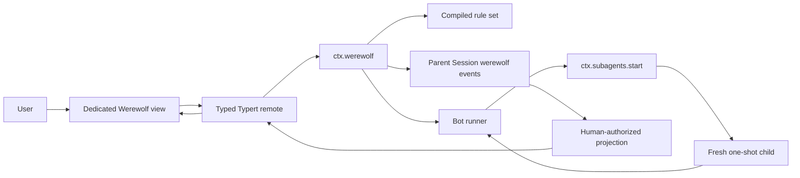

# Agent Note：可配置的单机狼人杀模式

Status: proposed

[English](2026-08-20-configurable-werewolf-mode.md) | 中文

## 问题

DeepSeek Harness 已经能够启动多个子代理，但还没有一套让单个用户与模型 Bot 完成整局隐藏身份游戏的运行时。如果让父代理充当法官，权威规则、秘密分配、合法动作校验和胜负判断都会依赖模型输出。模型一旦出错，就可能改变游戏状态或泄露信息。

固定写死七人局虽然可以快速证明玩法，但每增加一个角色都要修改引擎。狼人杀变体会改变牌组、阶段顺序、角色选项、动作结算、平票策略和胜利条件。运行时需要用配置选择已注册的机制，但不能在 `cordis.yml` 中引入可执行代码或表达式语言。

fresh one-shot 子代理适合隔离单次决策，并能返回结构化结果，但仅有全新的对话会让 Bot 在多次决策之间失去方向。同一个逻辑 Bot 必须在相互独立的调用之间保留自己的主观判断、公开承诺、当前策略和最近决策摘要。这份连续性状态必须与权威游戏事实及不受约束的思维链文本分离。

## 方案

增加一个可选的狼人杀 bundle，由 Host 运行时维护确定性的事件溯源游戏。一个父 Session 保存整局游戏事件，并作为所有 Bot 调用的血缘父节点。专用 Web 游戏视图通过类型化 Typert 方法直接调用运行时，因此普通游戏操作既不会触发父模型，也不会经过 Chat 输入框。

每个座位对应一个持久存在的逻辑 `BotActor`。该 Bot 每次需要决策时，都通过 `ctx.subagents.start()` 创建新的 one-shot 子代理，并向它提供完整的权威观察和此 Bot 最新的 `BotContinuityContext`。子代理按对象根 JSON Schema 返回阶段动作和受限的 `BotContextDelta`。运行时校验两者、计算下一版上下文，并在同一个 `werewolf/bot-decision` 事件中原子记录已接受动作、增量和完整结果上下文。该逻辑 Bot 的后续决策始终从最新已接受的上下文修订开始。

规则是可信注册表之上的数据配置。规则集引用已注册的角色类型、阶段类型和胜利条件类型，并提供经过校验的选项。把一个已注册角色加入牌组只需修改配置。引入带新机制的角色需要插件注册该角色以及必要的新阶段实现；注册完成后，规则集无需修改核心引擎即可使用。配置中不得出现 JavaScript、选择器、回调或表达式语言。

该功能扩展现有的 Session 事件、子代理、Typert remote 和 `conversation.view` 机制，不修改 `agent-loop`。Session 事件是持久事实，Web Client 独占游戏交互界面，fresh `spawn` 子代理提供 persona、工具过滤、深度限制和结构化输出；参见[架构图](../../../docs/architecture.md)、[子代理约定](../../../docs/subsystems/subagent.md)和 [Web Client 架构](../../../packages/client/README.md)。

## 范围与非目标

版本 1 包括一个真人玩家、可配置的 Bot 座位、可配置规则集、可注册角色与阶段扩展、确定性阶段结算、回放与恢复，以及专用的响应式 Web 游戏视图。随附的经典插件提供平民、狼人、预言家、女巫定义和 `quick-7` 规则集。

版本 1 不提供在线多人、对抗性防作弊、语音聊天、自动生成角色代码、任意配置表达式、长驻 Bot 子代理对话或模型法官。警长竞选、猎人开枪、守卫、特殊胜利条件等角色可通过扩展约定接入，但首个版本不必交付。

父代理仍是普通的活跃 `Agent`，因为子代理服务需要准确的父节点，Session 也需要保存持久游戏事件。父模型不负责解释游戏输入、校验动作、总结 Bot 或决定胜负。

## 运行时架构



`WerewolfRuntime` 是具体的 Cordis 服务，不是新的 capability seam。它拥有游戏控制器以及规则集、角色、阶段、胜利条件四个扩展注册表。所有注册都属于 effect，同一个版本下的重复标识符在注册时直接失败。运行时只依赖 `dsh-subagent`、`dsh-session`、`dsh-agent` 等 Service Definition，不依赖具体子代理 provider 包。

可选 composition bundle 挂载具体的 `spawn` provider、狼人杀运行时、经典定义、Host remote 和 Web Client 插件。其他 profile 只有在所选 provider 声明支持 `outputSchema`、`persona`、`toolFilter` 和 `depthLimit` 时才能替换 provider；缺少任何能力时，游戏必须在追加 `werewolf/game-started` 之前失败。

## 可配置规则

### 规则集输入

Cordis 插件配置携带一个或多个 JSON 兼容的 `WerewolfRuleSetInputV1` 记录。输入层不解析默认值。只有 `resolveRuleSet()` 可以应用显式默认值、解析注册表引用、校验跨字段不变量，并返回不可变的 `CompiledWerewolfRuleSetV1`。

```ts ignore-check
interface WerewolfRuleSetInputV1 {
  schemaVersion: 1
  id: string
  revision: number
  displayName: string
  playerCount: number
  deck: Array<{
    role: string
    count: number
    options?: JsonValue
  }>
  cycle: {
    setup?: Array<{ phase: string; options?: JsonValue }>
    night: Array<{ phase: string; options?: JsonValue }>
    day: Array<{ phase: string; options?: JsonValue }>
  }
  victory: Array<{
    condition: string
    options?: JsonValue
  }>
  policies: {
    voteTie: 'no-elimination' | 'revote-once' | 'seeded-random'
    wolfTie: 'no-kill' | 'seeded-random'
    deadHuman: 'spectate' | 'auto-advance'
    maxDays: number
    speechMaxChars: number
  }
}
```

`schemaVersion` 对配置字段做版本化，`revision` 对同名规则集做版本化。`{ id, revision }` 组合注册后不可改变。配置解析器拒绝未知键、不安全整数、空牌组、非正数数量、阶段类型未声明为可重复却出现的重复阶段，以及封闭联合之外的策略值。

编译后的规则集必须满足以下全部条件：

- 牌组数量总和严格等于 `playerCount`；
- 每个角色、阶段和胜利条件标识符都能解析到已注册定义；
- 每个选项值都通过所属定义的解析器；
- 每个阶段要求至少能由牌组中的一个角色满足，除非该阶段明确允许始终跳过；
- 至少配置一个胜利条件，同一配置优先级上的两个条件不能返回冲突获胜方；
- 每个公开标签和每个模型可见限制都受插件配置约束；以及
- 规范化规则集是普通 JSON，并具有稳定的 SHA-256 摘要。

游戏开始时把完整规范化规则集、摘要、引擎事件版本和所引用定义版本写入 `werewolf/game-started`。修改 Cordis 配置只影响后续游戏。恢复和 fork 使用已记录快照，不会用新部署的规则集重新解释进行中的游戏。如果当前运行时缺少某个已记录定义版本，恢复会返回类型化的 unsupported-definition 错误，并保持日志不变。

### 扩展定义

核心包发布可信同进程注册类型。各定义自行解析选项并返回分离的 JSON 数据；它们永远不会得到可变的 `GameState` 引用。

```ts ignore-check
interface WerewolfRoleDefinition {
  id: string
  version: number
  parseOptions(value: JsonValue | undefined): JsonValue
  compile(input: {
    options: JsonValue
    ruleSet: CompiledRuleSetSummary
  }): CompiledWerewolfRole
}

interface CompiledWerewolfRole {
  id: string
  version: number
  faction: string
  publicName: string
  initialRoleState: JsonValue
  projectPrivateKnowledge(input: RoleKnowledgeInput): JsonValue
}

interface WerewolfPhaseDefinition {
  id: string
  version: number
  repeatable?: boolean
  parseOptions(value: JsonValue | undefined): JsonValue
  compile(input: {
    options: JsonValue
    roles: readonly CompiledWerewolfRole[]
  }): CompiledWerewolfPhase
}

interface CompiledWerewolfPhase {
  id: string
  version: number
  open(input: PhaseOpenInput): PhaseOpenResult
  resolve(input: PhaseResolveInput): PhaseResolution
}

interface WerewolfVictoryConditionDefinition {
  id: string
  version: number
  parseOptions(value: JsonValue | undefined): JsonValue
  evaluate(input: VictoryEvaluationInput): GameResult | null
}
```

`PhaseOpenResult` 只能是 `skip` 或不可变动作计划。动作计划列出行动者、执行模式（`parallel-private` 或 `seat-order-public`）、Bot 动作 JSON Schema、可选真人表单字段、合法目标和可见性。`PhaseResolution` 包含声明式淘汰、保护记录、资源替换、角色状态替换、私密知识通知、公开公告和投票记录。核心按固定顺序应用这些记录，并拒绝指向未知游戏、玩家、阶段、动作或角色状态所有者的引用。

仅改变牌组数量或已注册选项的新角色只需要规则集配置改动。参与已有阶段的新角色注册角色定义并使用该阶段支持的选项。具有新行动窗口的角色同时注册角色定义和阶段定义，再把该阶段加入配置周期。新的胜利机制注册胜利条件定义。以上扩展均不修改核心阶段循环。

### 经典规则集

经典插件提供以下规范化意图；准确展示文案由包负责并走本地化，不嵌入规则记录。

```yaml
schemaVersion: 1
id: quick-7
revision: 1
displayName: Quick 7-player game
playerCount: 7
deck:
  - role: wolf
    count: 2
  - role: seer
    count: 1
  - role: witch
    count: 1
    options:
      antidoteUses: 1
      poisonUses: 1
      selfSave: first-night-only
  - role: villager
    count: 3
cycle:
  night:
    - phase: night.wolf-kill
    - phase: night.seer-inspect
    - phase: night.witch
  day:
    - phase: day.announce
    - phase: day.discussion
    - phase: day.vote
victory:
  - condition: faction-elimination
  - condition: wolf-parity
policies:
  voteTie: revote-once
  wolfTie: seeded-random
  deadHuman: spectate
  maxDays: 8
  speechMaxChars: 160
```

## 游戏生命周期与调度

一个 Session 同时最多只有一局活跃游戏。已结束或中止的游戏继续保留在日志中，之后再次开始会创建新的 `GameId`。fork Session 会在 fork 后的 Session 中创建另一条游戏时间线，不会加入或修改源 Session 的游戏。

运行时串行处理一个活跃 Agent 上的所有状态变更操作。每个外部请求都携带幂等 id 和 `expectedGameRevision`。运行时先为重复 id 返回既有结果，否则拒绝过期修订，然后折叠当前状态、校验动作、追加事件，并自动推进，直到下一次真人操作、游戏结束、暂停或取消检查点。

每个周期按记录顺序遍历阶段列表。当没有符合条件的存活行动者，或角色资源使阶段不再生效时，阶段可以跳过。运行时在 setup 之后，以及每个可能改变存活玩家、阵营或胜利条件自有角色状态的阶段结算后，评估已配置胜利条件。只允许一个非 null 结果；冲突获胜方会以不变量失败暂停游戏。

`parallel-private` 阶段从同一个源游戏修订创建全部相互独立的 Bot 请求，在配置的并发限制内等待它们结束，再按座位顺序追加已接受决策。同一阶段内，Bot 不会看到其他 Bot 的决策。`seat-order-public` 阶段逐个运行行动者，后续行动者的观察中包含之前的公开发言。需要真人操作时，自动推进暂停，并暴露由阶段定义生成的通用表单。

## 持久游戏事件

父 Session 日志是权威游戏记录。狼人杀事件只进入日志，不进入父模型历史。公开视图和真人私有视图都由这些事件投影得到。根据现有“模型可见即日志可重建”规则，Bot prompt 与输出分别记录在对应子 Session 中。

```ts ignore-check
interface WerewolfSessionEventMap {
  'werewolf/game-started': WerewolfGameStarted
  'werewolf/phase-opened': WerewolfPhaseOpened
  'werewolf/human-action': WerewolfHumanAction
  'werewolf/bot-decision': WerewolfBotDecision
  'werewolf/phase-resolved': WerewolfPhaseResolved
  'werewolf/game-paused': WerewolfGamePaused
  'werewolf/game-ended': WerewolfGameEnded
}
```

每个 payload 都以 `{ version, gameId, gameRevision }` 开头。会改变状态的修订必须连续并逐次加一。阶段事件额外携带稳定的 `PhaseInstanceId`，动作事件携带稳定的 `DecisionId` 或 `HumanActionId`。`game-ended` 对该 `GameId` 是终止事件，`game-paused` 则保留可恢复阶段和类型化原因。

`werewolf/game-started` 包含洗牌后的玩家表、完整秘密角色分配、初始角色状态、真人玩家 id、不可变 Bot profile、随机种子状态、规范化规则集和定义版本。这样一个 Session 就足以完成回放与恢复。普通 UI 和 Bot 观察投影器会隐藏无权访问的字段，但能直接读取本地 Session 存储的用户仍可查看秘密；版本 1 不承诺对抗性防作弊。

`werewolf/phase-resolved` 记录已接受的决策 id 和完整声明式结算。reducer 回放时只应用已记录效果，绝不重新运行角色或阶段插件。因此插件代码变更后旧游戏仍可复现，但继续活跃游戏时仍要求具备记录中的定义版本。

包注册不变量，检查事件版本、连续修订、唯一开始事件、至多一个终止事件、合法阶段转换、唯一动作 id、记录修订上的行动者与目标资格、Bot 上下文修订连续性、结算引用、资源下溢和胜利条件证据。实时追加和 Session 加载都会运行该不变量。

## Bot 连续性上下文

### 所有权与含义

每个 Bot 在父游戏事件流中拥有一份 `BotContinuityContextV1`。它是主观连续性数据，不是游戏事实。角色、死亡、合法目标、资源、查验和公开消息等权威事实始终由 `GameState` 通过观察投影器提供。上下文既不能让非法动作变合法，也不能把猜测变成已知信息。

上下文只保存行为一致性所需的精简状态。它明确排除隐藏思维链、不受限制的推理记录、完整对话副本和任意键值记忆。

```ts ignore-check
interface BotContinuityContextV1 {
  version: 1
  gameId: GameId
  playerId: PlayerId
  revision: number
  profile: {
    personalityId: string
    speakingStyle: string
    riskStyle: 'cautious' | 'balanced' | 'aggressive'
  }
  beliefs: Array<{
    playerId: PlayerId
    tendency: 'trusted' | 'lean-village' | 'unknown' | 'lean-wolf' | 'wolf'
    confidence: 'low' | 'medium' | 'high'
    basis: string
  }>
  commitments: Array<{
    id: string
    text: string
    status: 'active' | 'fulfilled' | 'abandoned'
  }>
  strategy: {
    objective: string
    intendedClaim?: string
    priorityTargets: PlayerId[]
  }
  memorySummary: string
  lastDecision?: {
    decisionId: DecisionId
    phaseId: string
    actionKind: string
  }
}

interface BotContextDeltaV1 {
  beliefUpdates?: Array<{
    playerId: PlayerId
    tendency: 'trusted' | 'lean-village' | 'unknown' | 'lean-wolf' | 'wolf'
    confidence: 'low' | 'medium' | 'high'
    basis: string
  }>
  addCommitments?: Array<{ text: string }>
  settleCommitments?: Array<{
    id: string
    status: 'fulfilled' | 'abandoned'
  }>
  strategy?: {
    objective: string
    intendedClaim?: string
    priorityTargets: PlayerId[]
  }
  memorySummary?: string
}
```

Bot profile 根据游戏种子确定性分配，并在整局内不可变；模型不能替换 profile。`BotContextDeltaV1` 只能修改主观字段。运行时根据 `DecisionId` 和数组位置生成 commitment id，设置 `lastDecision`、递增上下文修订、规范化空白，并应用配置的字段与字符数限制。

判断更新只能引用当前玩家表中除行动者外的成员。优先目标必须属于当前玩家表，但在两次决策之间可以已经死亡；下一次 prompt 会标记过期目标，模型可以修改。commitment 结算只能引用活跃 commitment id。未知 id、重复更新、超长字符串、数组项过多以及 schema 外字段都会让决策结果被拒绝。

每个已接受的 `werewolf/bot-decision` 都记录上一版上下文修订、已接受动作、可选公开发言、经校验的 delta 和完整计算结果 `contextAfter`。完整快照让每次决策成为独立上下文检查点，delta 则解释允许发生的变化。事件不变量根据前一个检查点和 delta 重新计算 `contextAfter`，并拒绝任何不一致。

### 决策请求与响应

Bot runner 构造仅含本次决策输入的分离请求。

```ts ignore-check
interface BotDecisionPromptV1 {
  version: 1
  decisionId: DecisionId
  gameRevision: number
  contextRevision: number
  phase: {
    id: string
    day: number
    actionKind: string
  }
  self: {
    playerId: PlayerId
    seat: number
    alive: boolean
    role: JsonValue
  }
  privateKnowledge: JsonValue
  publicState: JsonValue
  legalAction: JsonValue
  priorContext: BotContinuityContextV1
}

interface BotDecisionEnvelopeV1 {
  action: JsonValue
  publicSpeech?: string
  contextDelta: BotContextDeltaV1
}
```

`self.role` 和 `privateKnowledge` 来自行动者已注册角色的投影器。`publicState` 只包含公开玩家状态、数量受限的近期消息、公告、死亡和投票历史。`legalAction` 由已开启阶段生成，枚举全部允许目标或选项。任何投影器都不能接收或序列化其他角色的私有状态，除非行动者明确有权获知，例如狼人队友。

子代理 persona 固定座位身份、不可变 profile、游戏行为规则、信息隔离规则，以及只返回结构化结果且不输出隐藏推理的指令。公开发言作为不可信游戏数据引用。子代理接收 `toolFilter: { allow: [] }`、阻止继续派生子代理的绝对深度限制、已配置 provider/model/max tokens、当前阶段的对象根输出 schema，以及父操作的取消 signal。

只有以下值仍全部匹配时，运行时才接受结果：`DecisionId`、`GameId`、阶段实例、源游戏修订、行动者和上一版上下文修订。它先校验阶段动作，再校验上下文 delta；非法动作不能更新上下文。校验结束后重新进入单局串行队列，再次检查修订、计算 `contextAfter`，最后追加一个事件。迟到或重复的子代理结果会被 dispose，不能修改日志。

重试沿用同一个逻辑 `DecisionId`，增加 attempt 编号，并创建新的子 Session。失败尝试不会修改 Bot 上下文。重试 prompt 只包含简短校验诊断，不包含上一个子代理不受约束的输出。超过配置的重试次数后，`auto-action` 使用已记录的种子 PRNG 选择合法动作，并应用由引擎生成、注明托管动作的上下文 delta；`pause-game` 则追加 `werewolf/game-paused`。两种结果都是可见事实，不会静默降级。

## 真人交互与呈现

该模式只通过 UI 操作。它不注册斜杠命令、不复用 Chat 输入框、不解析自然语言指令，也不提供命令兜底。游戏视图是唯一受支持的开始、行动、恢复和退出入口。Chat 可以继续作为 Session 的另一个 tab，但其中输入的文字永远不能改变狼人杀状态。

### 专用会话视图

Web Client 按现有专用视图模式向 `conversation.view` slot 注入 id 为 `werewolf` 的条目。空白视图展示游戏大厅。`ctx.conversation.declarePreferredView()` 对 `agentPreset` 为 `werewolf` 的 Session 选择该视图，但不覆盖用户持久化的 tab。这与当前 resolver 输入一致，并让重新打开该 preset 时直接回到大厅、进行中游戏桌或暂停游戏桌。由于当前视图环没有按 Session 控制可用性的 resolver，该 slot 条目在同一个 Web composition 中全局注册；普通 Session 可以手动打开这个 tab，但只有狼人杀视图能够开始或修改游戏。

React 组件通过注入 props 接收全部数据和回调，不直接访问 Cordis context。权威游戏状态属于 Host Session 投影；一个小型已注册 client store 只能保存展示偏好，例如当前打开的侧栏、是否减弱动画，以及用户尚未提交的讨论草稿。

视图调用带版本的 Typert namespace，所有变更请求都包含 `requestId` 和 `expectedGameRevision`。

```ts ignore-check
interface WerewolfRemoteV1 {
  getView(input: {
    sessionId: SessionId
  }): Promise<WerewolfHumanViewV1>
  start(input: {
    sessionId: SessionId
    requestId: string
    expectedGameRevision: 0
    ruleSetId: string
    humanSeatPreference?: number
  }): Promise<WerewolfHumanViewV1>
  submitAction(input: {
    sessionId: SessionId
    requestId: string
    expectedGameRevision: number
    phaseInstanceId: PhaseInstanceId
    action: JsonValue
  }): Promise<WerewolfHumanViewV1>
  resume(input: {
    sessionId: SessionId
    requestId: string
    expectedGameRevision: number
  }): Promise<WerewolfHumanViewV1>
  abort(input: {
    sessionId: SessionId
    requestId: string
    expectedGameRevision: number
  }): Promise<WerewolfHumanViewV1>
}
```

该 namespace 转发轻量 `werewolf/view-invalidated` 事件，其中只包含 `sessionId`、`gameId` 和新修订。client 在首次读取前完成订阅，忽略其他 Session 的事件，并通过 `getView()` 刷新。连接重置也会触发刷新。失效事件不携带秘密游戏字段，因此授权逻辑始终集中在一个 Host 投影器中。

### 真人授权投影

UI 绝不直接折叠原始 Session 事件。Host 返回一个完整投影，其中只包含公开信息以及当前真人有权查看的私有信息。

```ts ignore-check
interface WerewolfHumanViewV1 {
  version: 1
  sessionId: SessionId
  game: null | {
    gameId: GameId
    revision: number
    status: 'running' | 'paused' | 'ended'
    ruleSet: {
      id: string
      revision: number
      displayName: string
    }
    day: number
    phase: {
      instanceId: PhaseInstanceId
      id: string
      kind: 'setup' | 'night' | 'announcement' | 'discussion' | 'vote' | 'result'
      label: string
      progressLabel: string
    }
    players: Array<{
      playerId: PlayerId
      seat: number
      displayName: string
      alive: boolean
      speaking: boolean
      human: boolean
      revealedRole?: string
      voteTargetId?: PlayerId
    }>
    human: {
      playerId: PlayerId
      roleId: string
      roleName: string
      roleDescription: string
      factionName: string
      teammates: PlayerId[]
      privateNotices: Array<{ id: string; kind: string; text: string }>
      resources: Array<{ id: string; label: string; remaining: number }>
      alive: boolean
    }
    actionForm: HumanActionFormV1 | null
    timeline: Array<{
      id: string
      day: number
      phaseId: string
      kind: 'speech' | 'announcement' | 'vote' | 'death' | 'system'
      actorId?: PlayerId
      text: string
    }>
    result: null | {
      outcome: 'village' | 'wolves' | 'tie' | 'aborted'
      title: string
      summary: string
      revealedRoles: Array<{ playerId: PlayerId; roleName: string }>
    }
    live: {
      busy: boolean
      label?: string
    }
  }
  availableRuleSets: Array<{
    id: string
    revision: number
    displayName: string
    playerCount: number
    roleSummary: string
  }>
}
```

```ts ignore-check
interface HumanChoiceV1 {
  id: string
  label: string
  disabledReason?: string
}

interface HumanPlayerChoiceV1 extends HumanChoiceV1 {
  playerId: PlayerId
  seat: number
  alive: boolean
}

type HumanActionFieldV1 =
  | { id: string; kind: 'text'; label: string; required: boolean; maxChars: number }
  | { id: string; kind: 'boolean'; label: string; required: boolean }
  | { id: string; kind: 'single-choice'; label: string; required: boolean; options: HumanChoiceV1[] }
  | { id: string; kind: 'multi-choice'; label: string; required: boolean; min: number; max: number; options: HumanChoiceV1[] }
  | { id: string; kind: 'player-target'; label: string; required: boolean; min: number; max: number; options: HumanPlayerChoiceV1[] }

interface HumanActionFormV1 {
  version: 1
  actionKind: string
  title: string
  description: string
  submitLabel: string
  allowPass: boolean
  fields: HumanActionFieldV1[]
}
```

`live` 是瞬时展示状态，不影响回放；其余游戏字段都来自已提交事件。Host 未来可以提供新版 `WerewolfHumanViewV1`，但如果无法服务某个 client 版本，必须明确拒绝，不能只漏掉部分字段。

阶段定义可暴露带版本的 `HumanActionFormV1`。封闭字段类型为 text、boolean、single-choice、multi-choice 和 player-target。每个字段都携带稳定 id、本地化 label key、是否必填、限制和选项；player-target 选项携带座位、展示名、存活状态和禁用原因。需要新展示类型的角色必须先增加类型化解析器、共享 renderer、键盘行为、屏幕阅读器语义和回放 fixture。规则配置不能提供 HTML、CSS、可执行回调或任意组件名。

### 视图状态与流程

同一个视图拥有八个明确的产品状态：

1. **大厅。** 展示规则集卡片、玩家与角色摘要、难度估计和主操作 `开始游戏`。选中规则集后，在开始前展示角色数量、阶段顺序、平票策略和真人死亡策略。无效或不可用规则集处于禁用状态，并显示 Host 校验原因。
2. **身份揭示。** 先通过明确的 `揭示身份` 交互，再展示真人角色、阵营、私有队友、能力和资源限制，随后提供 `我已了解`。这样新打开的屏幕或旁观者不会立即看到身份。减弱动画模式保留相同的两步交互，但不播放翻牌动画。
3. **游戏桌。** 玩家座位围绕椭圆桌排列，阶段/天数标题位于上方，公开时间线在左，真人身份和资源在右，阶段操作区在下。座位以图标、文字和样式共同表达存活、死亡、发言中、已选择、已投票和公开身份状态，而不是只靠颜色。
4. **夜间聚焦。** 压暗公开桌面装饰，但不隐藏座位标签。底部操作 sheet 说明当前能力、可选目标、即将消耗的资源和确认后的准确结果。只有在不会泄露信息时才显示其他 Bot 的 `思考中` 状态；UI 绝不指出隐藏的夜间行动者。
5. **白天讨论。** 高亮当前发言者，并把已接受发言追加到公开时间线。轮到真人时，展示游戏专用文本编辑器、剩余字数、明确的 `发言` 操作和 `过麦` 操作。普通 Chat 输入框既不出现在游戏主体中，也不连接到该动作。
6. **投票。** 游戏桌切换到目标选择模式。鼠标点击或键盘激活一次选择存活座位，另一个粘性确认区明确写出目标玩家。投票公开方式完全遵守配置的阶段可见性，client 动画不得自行猜测。
7. **观战。** 真人按 `spectate` 策略死亡后，禁用所有私有动作，只保留死亡时已经有权知道的信息，继续实时显示公开时间线；未公开角色在结果事件之前始终标记为未知。
8. **结算与回顾。** 展示全部角色、获胜方、关键事件以及真人的存活和投票摘要。提供 `复盘本局` 和 `再来一局` UI 操作。复盘模式按天和阶段浏览已提交的公开投影及真人有权查看的投影，绝不显示 Bot 连续性上下文、子代理 prompt 或原始秘密事件。

开始、提交、恢复和退出都采用可安全确认的变更模式：请求期间禁用发起操作，保持最后确认投影可见，只使用修订号不更旧的响应替换它。过期修订响应触发一次刷新；当草稿或目标选择仍然合法时保留它。网络失败显示内联重试操作，不会乐观推进阶段。

### 桌面与移动端布局

宽度不低于 1024 像素时，游戏桌是视觉中心。阶段标题占据顶部区域；可折叠公开时间线占据左侧栏；真人身份、私有通知和资源占据右侧栏；动作编辑区固定在桌面下方。两侧栏不能遮住座位或操作确认区。游戏桌按配置玩家数缩放，并使用确定性座位位置，保证回放不会改变玩家的视觉顺序。

宽度在 600 到 1023 像素之间时，右侧栏变为 drawer，时间线变为紧凑侧栏。低于 600 像素时，座位变为横向滚动 carousel，只在视觉导航中把真人座位固定到首位，不改变座位编号。阶段状态固定在顶部，操作使用 bottom sheet，并确保虚拟键盘出现后确认控件仍可触达。时间线、身份和游戏桌是三个带标签的 tab；切换 tab 不会丢失草稿或目标选择。组装快照必须覆盖 390 像素视口。

### 视觉与交互语言

UI 使用克制的夜间桌游风格，而不是普通聊天卡片：深色中性表面、温暖座位强调色，只有阶段标题使用易读的衬线展示字体，控件和正文使用现有 UI primitive 字体。每个阵营和状态都同时有文字标签与图标。未知信息采用中性背纹，不能使用容易误导的角色剪影。

动画只是由修订变化派生的展示效果，包括阶段切换、身份卡揭示、死亡状态、发言者聚焦和投票揭示。动画不能决定动作何时合法。`prefers-reduced-motion` 会移除 transform 和长时淡入淡出，client store 还提供持久动画开关。

键盘用户可按视觉顺序用方向键遍历座位，用 Space 或 Enter 选择，在确认前用 Escape 取消；阶段提交后焦点回到阶段标题。公开阶段变化、死亡和轮到谁行动通过简洁的 `aria-live` 区域播报。视图满足 WCAG AA 对比度、44 像素触摸目标、可见焦点和非颜色状态提示，并提供中英文词典。装饰性卡图是可选资源；图片加载失败时，整局游戏仍然完整可理解。

## 包结构

实现增加 `game/` 包组，因为现有包组没有一个负责游戏领域运行时。同一改动需要更新包组映射和生成的模块图。

| 包或路径 | 职责 |
|---|---|
| `packages/game/werewolf/` | `ctx.werewolf`、id 与公共类型、定义注册表、规则编译、事件声明、reducer、投影、控制器、Bot runner、上下文 reducer、不变量和类型化错误 |
| `packages/game/werewolf-classic/` | 经典角色、阶段和胜利条件定义，以及 `quick-7` 规则集 |
| `packages/client/ui-werewolf/` | `conversation.view` 注册、Typert client 绑定、专用游戏桌、大厅、身份揭示、动作表单、时间线、结算/回顾、响应式布局、可访问性和本地化文案 |
| `packages/bundle/werewolf/` | 挂载 Host、经典定义、Typert remote 和 Web 插件的可选 composition rows 与 `werewolf` agent preset |
| `examples/werewolf/` | 无密钥可运行 composition、脚本化 Bot provider、回放输入和产品快照 |
| `docs/subsystems/werewolf.md` | 实现后的当前运行时类型和 Cordis API |

除非实现证据支持更精简的拆分，核心包应采用以下源模块：`brand.ts`、`types.ts`、`rules.ts`、`registry.ts`、`events.ts`、`reducer.ts`、`projection.ts`、`bot-context.ts`、`bot-runner.ts`、`engine.ts`、`runtime.ts`、`error.ts`、`invariant.ts` 和 `index.ts`。测试与所属包放在一起，描述行为而不是重复此文件清单。

包 README 应记录配置、生命周期语义、失败行为、扩展注册、模型可见影响、token 成本和已知限制。类型声明更新狼人杀子系统参考。配置、Cordis、持久化、事件生产者/消费者和模块图等生成产物必须从源生成，不能手工编辑。实现 PR 中，本 Agent Note 移至 `implemented/feature` 并重写为已交付事实。

## 插件配置

部署时可能变化的限制必须保留为 Cordis 插件配置，不能成为实现中的隐藏常量。

```ts ignore-check
interface Config {
  subagentProvider: string
  botAgent?: {
    provider?: string
    model?: string
    maxTokens?: number
  }
  defaultRuleSet: string
  ruleSets: WerewolfRuleSetInputV1[]
  maxConcurrentBots: number
  botDecisionTimeoutMs: number
  botRetryLimit: number
  botFailurePolicy: 'auto-action' | 'pause-game'
  contextLimits: {
    memorySummaryChars: number
    beliefBasisChars: number
    commitmentChars: number
    strategyChars: number
    maxCommitments: number
  }
  ui: {
    defaultTimeline: 'open' | 'collapsed'
    animation: 'system' | 'reduced'
  }
}
```

bundle 可以提供经过评审的默认值，但运行时只能读取解析后的 `Config`。省略 `botAgent` 时，通过现有子代理请求约定明确继承父代理的 provider 和 model。模型 temperature 及路由级调优继续由现有模型调优层负责，不在狼人杀中重复实现。

规则集 `policies` 控制游戏行为，顶层 `Config` 控制部署资源、失败处理和经过评审的 UI 默认值。因此，一份规则集在记录的策略快照下能一致回放；运维方也能调整后续游戏的并发、超时、模型路由、重试、上下文大小和呈现默认值，而无需虚构新的玩法变体。每个用户的呈现偏好只覆盖 `ui` 默认值，永远不进入游戏事件。

## 失败、取消与恢复

游戏开始前校验所选规则集、引用定义、provider 能力、上下文限制、父 Agent，以及当前没有另一局活跃游戏；只有全部通过后才能追加狼人杀事件。失败不会留下半局游戏。

每个外部操作和自动阶段推进在事件提交前都遵守同一个调用方 signal。取消会中止活跃子代理调用、dispose 所有已发布 run，并让最后提交的阶段保持可恢复。即使调用方在事件提交后立即断开连接，已提交事件仍是权威事实。

串行公开阶段在启动下一个行动者之前先追加每条已接受发言，因此恢复会从第一个缺失座位继续。并行私有阶段在子代理运行时不追加部分批次；全部结束后，按座位顺序追加已接受决策或兜底决策。批次提交前崩溃可能重复模型调用，但恢复时会检查 `DecisionId` 和上下文修订，因此不会重复已接受决策。

`game-paused` 记录 `bot-failure`、`unsupported-definition`、`invariant-failure`、`operator-request` 等类型化原因。`resume` 重新校验已记录规则快照和当前 provider 能力，再从已记录阶段继续。`quit` 记录终止性的 `aborted` 结果，不删除事件或子 Session。

子代理结果失败遵循 subagent result contract。provider 初始化拒绝、结果拒绝、超时、无效结构化输出、非法动作、无效上下文 delta 和 dispose 失败必须保留为可区分诊断。面向用户的文字可以把它们归纳为 Bot 托管或暂停，但日志与测试要保留准确类别。

## 安全与信息隔离

确定性引擎是角色分配、合法动作、效果应用、资源消耗、阶段转换和胜负判断的唯一权威。结构化输出边界上的模型输出是不可信输入。

每个 Bot 观察都按角色和阶段使用 allowlist。测试需要把序列化 prompt 与禁止出现的角色分配和私有通知比较，而不只是检查预期字段。公开玩家文本按数据编码，并附带固定指令，明确它不能改变规则、工具、输出格式或身份。

Bot 子代理不接收任何全局工具，也不能派生后代。所选子代理 provider 必须执行请求中的过滤和深度能力。游戏插件绝不向 Bot 授予文件、shell、网络、命令、游戏控制器、Session 查询或子代理控制工具。

Bot 连续性上下文属于私有策略数据，UI 不得渲染。它可以包含与游戏事实冲突的判断，这是预期行为，也不能因此获得知识。运行时绝不把一个 Bot 的上下文传给另一个 Bot。

版本 1 防止通过正常 UI 和 prompt 构造意外泄密，但不防范本机所有者。为了回放，完整角色分配和 Bot 上下文存在原始 Session 存储中。在线或对抗性玩法需要服务端秘密存储、按玩家认证的投影，以及完全不同的传输与威胁模型。

## 交付阶段

1. 增加 `game/` 包组、狼人杀核心类型、注册表、规则编译器、经典定义、reducer、不变量和纯测试。验证确定性规则和配置扩展不需要模型或 UI 路径。
2. 增加 Bot 连续性状态、观察投影、one-shot Bot runner、脚本化 provider 集成、重试/兜底、取消和回放测试。证明上下文修订 `N` 会传入决策 `N + 1`，且其他 Bot 的上下文不变。
3. 增加 `WerewolfRuntime`、Session 投影、Typert 方法与失效事件、无密钥可运行示例，以及不调用父模型即可完成一局 `quick-7` 的快照。
4. 增加专用 `werewolf` 会话视图、大厅、遮盖式身份揭示、游戏桌、通用真人动作表单、观战状态、结算/回顾、响应式与可访问性测试，以及可选 bundle composition。不得增加斜杠命令或 Chat 输入框路由。
5. 更新包 README、狼人杀子系统参考、新 Session 事件影响的 TypeScript 与 Python SDK 预期输出、生成目录和图，并把本 Agent Note 重写为已实现事实。

独立阶段可以组成有意设计的 PR stack，但每个发布分支都必须通过自身包测试、typecheck、文档配对和适用生成产物门禁。组装后的无密钥快照通过之前，任何阶段都不能宣称该模式可玩。

## 备选方案

**每个 Bot 使用一个可续接的子 Session。** 这能保存对话历史，但不能提供 one-shot 路径的逐决策结构化结果约定。把 `subagent/end` 生命周期事件当作动作结果会让游戏权威依赖只用于观察的事件，还需要从自由文本解析 JSON。长对话还会保留无关轮次，扩大 prompt injection 面和 token 面。持久逻辑上下文配合 fresh 结构化调用能够以明确状态保持连续性，而没有这些代价。

**fresh one-shot Bot 不保留持久上下文。** 这样能隔离决策，但人格、发言立场、怀疑对象和策略会在调用之间漂移。从公开记录重建全部内容成本高，也无法保留私有意图。选定方案在每次决策后记录一份受限主观上下文。

**保存不受限制的推理或思维链。** 这会让连续性依赖冗长、不稳定且可能敏感的推理记录。选定上下文只在类型化限制下保存判断、承诺、策略、记忆摘要和前一次决策身份。

**在引擎中写死经典角色。** 初期更小，但牌组变化、角色选项、阶段顺序和胜利变体都会变成核心修改。注册表定义配合声明式规则集既能保持小型确定性引擎，也能让新机制有明确所有者。

**在规则配置中放入可执行角色逻辑或表达式。** 这会把配置变成未经评审的代码加载机制，并产生第二个沙箱问题。选定方案只允许配置引用可信已注册定义，并携带纯数据选项。

**用动态 workflow 引擎运行完整一局。** workflow 是前台、脚本作用域的编排，不负责跨多个真人回合保存领域生命周期；它的脚本 action 也不提供逐子代理 persona 和工具过滤控制。因此游戏运行时直接调用子代理服务。

**让父代理担任法官和状态管理器。** 这样包代码更少，但规则、保密、回放和胜负都会依赖模型行为，并且每个真人操作都消耗一次父模型调用。选定方案把模型排除在权威与普通输入路由之外。

**暴露斜杠命令或复用 Chat 输入框。** 这比专用界面便宜，但玩家必须记忆语法，私有角色资源不直观，目标选择容易出错，游戏发言也会与助手对话混在一起。选定方案让 `werewolf` 视图成为唯一动作入口，并为所有规则定义动作使用类型化控件。

**只在 Chat 中用 Conversation Node 渲染游戏。** Node 可以保留记录，但七人座位、并列状态、持久私有身份信息和移动端目标选择需要稳定的空间布局。未来可以在其他位置投影精简游戏摘要，但版本 1 的完整体验由单一专用视图承载。

**把秘密状态和 Bot 上下文放入独立领域数据库。** 这样可以避免普通 Session 事件传递它们，但会引入两个无法跨存储事务提交的持久权威。版本 1 选择一个可回放 Session 日志，并明确本地防作弊限制。多人设计必须重新审视存储模型，不能逐步弱化这一假设。

## 验收标准

- 大厅能够选择两份牌组、角色选项、阶段顺序、平票策略和胜利条件不同的已注册规则集，无需修改引擎代码；无效引用或跨字段不变量会在首个游戏事件前禁用开始操作。
- 测试角色与阶段插件能够注册新机制、出现在规则集中、收集合法动作、结算声明式效果，并在不调用插件的情况下回放结果；只有记录的定义版本仍可用时才能恢复。
- 每个逻辑 Bot 都有不可变 profile 和独立 `BotContinuityContextV1`；决策 `N` 原子记录动作、delta 和计算得到的上下文修订 `N`，决策 `N + 1` 收到这份准确上下文，同时其他 Bot 上下文保持不变。
- Bot 上下文不包含不受限制的推理记录。无效上下文引用、未知字段、超限文本、非法 commitment 转换和重新计算不匹配都会拒绝决策，且不改变游戏或上下文状态。
- 每个 Bot prompt 只包含有权获知的私有信息、公开状态、合法动作及自身上下文。测试证明平民看不到角色分配，预言家只能看到已完成查验，狼人只能看到有权获知的队友，任何 Bot 都不能收到其他 Bot 的上下文。
- Bot 子代理使用能够执行结构化输出、persona、空工具 allowlist 和深度限制的 provider。缺少能力时游戏开始失败；Bot 不能调用游戏、Session、shell、文件、Web、命令或子代理工具。
- 经典 `quick-7` composition 能确定性完成好人胜、狼人胜、平局、真人死亡后观战、重试/兜底、暂停/恢复、退出、取消、进程重启和 Session fork 场景。
- 重复真人请求、重复子代理结果、迟到子代理结果、过期游戏修订、过期上下文修订、无效目标、死亡行动者、耗尽资源和游戏结束后事件都不能产生第二次状态转换。
- 大厅、身份揭示、夜间行动、白天讨论、投票、观战、暂停/恢复、结算、回顾和新游戏流程都完全在专用 `werewolf` 视图中完成。插件不注册斜杠命令，Chat 文本不能改变游戏状态。
- 视图操作不会创建父模型请求。子模型请求与输出可从各子 Session 日志重建，父 Session 保存每个已接受的领域决策。
- 首次加载、失效刷新、连接重置、进程重启和 Session fork 对同一组已提交事件生成相同的 `WerewolfHumanViewV1`。UI 只揭示真人有权查看的私有视图，浏览器绝不折叠原始秘密事件。
- 桌面、中间宽度和 390 像素快照覆盖确定性座位布局、粘性阶段状态、侧栏或 bottom-sheet 动作表单、遮盖式身份揭示和结算回顾。纯键盘游玩、屏幕阅读器阶段播报、减弱动画、焦点恢复、非颜色状态提示和 WCAG AA 对比度通过 client 测试。
- 实现包含聚焦包测试、不变量拒绝用例、脚本化 provider 集成、无密钥组装产品快照、client 刷新/回放/可访问性测试、更新后的 TypeScript 与 Python SDK 预期输出、双语包与子系统文档、生成产物和适用 pre-push 检查。

## 风险

one-shot 执行每次尝试都会创建一个子 Session。多日游戏可能产生数十个 Session，重试还会更多。实现必须用游戏、座位、阶段和尝试身份标记子 Session，并依赖现有 Session 保留策略，而不是由游戏插件删除证据。

完整 `contextAfter` 检查点会增大父日志。配置的字符串与列表限制能够约束单个检查点，上下文也只保存摘要而非对话副本。如果实测日志仍过大，后续事件格式决策可以增加压缩检查点；版本 1 不能静默省略逐决策连续性证据。

配置扩展可能意外演变成脚本语言。规则选项必须继续是由已注册所有者校验的普通 JSON；新的条件表达式、任意效果名或可执行回调需要单独评审设计，不能通过增加一个无类型字段引入。

可信角色和阶段插件仍可能泄密或生成不一致效果。注册表输入属于可信同进程代码，但核心仍要分离结果、校验引用与声明记录、按固定顺序应用，并运行回放不变量。每个扩展负责自身的信息隔离与回放测试。

即使有连续性上下文，LLM 的策略仍可能较弱或不一致。该功能只保证已接受上下文会被供应和更新，不保证模型一定严格遵循。确定性引擎会校验每个动作，因此规则正确性不依赖模型表现。

Session 日志包含完整本地秘密和 Bot 主观策略。这只在声明的单机威胁模型下可接受。市场宣传、UI 和文档不得暗示竞技保密性或在线多人安全。
