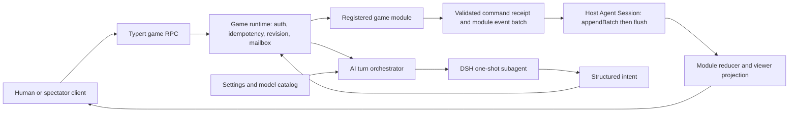

# Agent Note: DeepSeek Useless AI game platform

Status: proposed

English | [中文](2026-08-21-deepseek-useless-game-platform.zh.md)

## Problem

DeepSeek Harness already provides agents, one-shot and continuable subagents, durable sessions, model routing, settings, Typert RPC, and a browser client. It is still assembled as a general agent and coding product. DeepSeek Useless must retain DSH-X `model-hub` and the Feishu channel while product profiles isolate terminal, coding, writing, and editor capabilities. Feishu remains optional source first and later enters through the same game command and projection services.

The first game is Werewolf. Its deterministic stage-one core already owns registered rule definitions, durable events, replay, legal actions, seeded randomness, victory evaluation, and per-bot continuity state. The platform must preserve that work while making room for card games and DND-style games, whose scheduling, hidden information, interruption, narrative, and campaign models differ substantially.

A model cannot be the authority for game rules or state. Model output may be incomplete, malformed, inconsistent, or contaminated by secret information. Human clients are also untrusted. The server must validate every command, serialize concurrent mutations, record all accepted outcomes, and project only the information that a player or spectator may observe.

## Proposal

Build DeepSeek Useless as two cooperating planes on the existing Cordis plugin runtime:

- The **game plane** is a deterministic, server-authoritative command/event runtime. Each game module owns its rules, event vocabulary, reducer, legal actions, scheduler, victory or completion rules, and viewer-specific projection.
- The **AI plane** reuses DSH agents, subagents, sessions, model routing, settings, and usage accounting. It receives a projection prepared for one seat, returns a structured intent, and submits that intent through the same command path used by a human client.

The common game capability deliberately does not define universal phases, turns, roles, cards, encounters, or campaigns. Those concepts belong to game modules. The common capability owns instance binding, command admission, revision and idempotency checks, single-writer execution, module lookup, projection delivery, and the bridge to AI decisions.

The product starts as a local-first Web application in one Node.js process. A dedicated `game` profile and bundle select the product dependency closure. Existing packages remain in the repository until the game profile passes its acceptance checks; source deletion happens only after runtime composition proves that a package is not required.

## Design goals and non-goals

### Goals

- Support mixed human, AI, and spectator seats with seat-scoped visibility.
- Support sequential turns, simultaneous hidden-action barriers, response windows, and free-form narrative intents without forcing them into one scheduler.
- Replay, resume, and fork a game from durable events without repeating a model call or random draw.
- Keep model configuration and per-seat model selection in the existing provider/model settings system.
- Add a game by registering a module and UI renderer, without changing the agent loop or the platform command executor.
- Remove unrelated product features through bundle composition before deleting source packages.

### Non-goals

- High-frequency physics, action combat, lockstep simulation, or client-side authoritative gameplay.
- Distributed matchmaking, multi-region rooms, or horizontal game-instance migration in the first release.
- A universal declarative language that can express every game rule.
- Shipping proprietary DND settings or rulebook content; content packs require separate licensing review.
- Renaming every upstream package, npm scope, executable, or persisted DSH format during initialization.

## Current baseline and research findings

DSH-X supports this direction without replacing its core. The reviewed DSH-X `docs/architecture.md` makes Cordis composition, durable session events, scoped agents, and provider-routed LLM adapters explicit extension points. DSH-X `model-hub` provides provider/model authoring and failover, while the Feishu channel already has a separate bridge, identity allowlists, and card updates. The reviewed `packages/subagent/subagent/src/types.ts` supports one-shot runs, model selection, tool filters, cancellation, and durable child identity. The implemented Werewolf core in `D:\dev\DSH-X-werewolf` proves deterministic reduction and recorded randomness, while its revised configurable-mode proposal owns the remaining Bot runner, runtime API, projection, and UI delivery. These are source-snapshot references, not files copied into this design-only directory.

### Fork baseline

Official `dsh-v0.1.0-rc.8` remains the upstream compatibility and delta-audit baseline; it is not the implementation branch point for DeepSeek Useless. The implementation branch starts from one exact DSH-X integration commit after Werewolf is complete, current DSH-X master is integrated, `model-hub` and Feishu remain present, and the worktree is clean and identified by an exact commit or tag. The current `D:\dev\dsh-u` directory carries design artifacts only and is not the final implementation baseline. No game code is synchronized from a local branch before that frozen commit exists.

The frozen commit must satisfy all of these conditions:

- The deterministic Werewolf core, one-shot bot runner, Session controller, human projections, typed RPC, dedicated Web view, keyless `quick-7` snapshot, pause/resume, replay, and fork acceptance are complete.
- Werewolf stage three follows this note's instance ownership, batch append, caller identity, and AI provider rules, avoiding a Werewolf-specific controller beside the common game controller after the fork.
- DSH-X master changes, including `model-hub`, Feishu fixes, and other fork-owned commits, are integrated by semantics; source and integration worktrees contain no uncommitted files.
- Focused game tests, typecheck, build, hygiene, documentation gates, and the assembled product snapshot pass. The final fork record names an exact commit or tag rather than a moving branch.

External game frameworks were reviewed for patterns, not selected as dependencies:

| Source | Useful evidence | Decision for this project |
|---|---|---|
| [boardgame.io concepts](https://boardgame.io/documentation/) | Pure moves and separate phase, turn, and per-player stage concepts keep rule transitions explicit. | Keep module reducers and schedulers pure; do not impose its phase model on DND-style games. |
| [boardgame.io secret state](https://github.com/boardgameio/boardgame.io/blob/main/docs/documentation/secret-state.md) | Secret data must be removed before transport, not merely hidden by the UI. | Make `project(state, viewer)` the only source for browser and model observations. |
| [boardgame.io randomness](https://github.com/boardgameio/boardgame.io/blob/main/docs/documentation/random.md) | Server-held deterministic randomness enables replay and prevents clients from predicting the stream. | Inject randomness into command evaluation and record outcomes or resulting RNG state in durable events. |
| [XState actors](https://stately.ai/docs/actors) | Actors process a private mailbox one message at a time and expose state through messages or snapshots. | Give each game instance one serialized command mailbox; do not add XState while the existing reducer remains sufficient. |
| [Colyseus rooms and state](https://docs.colyseus.io/room) | Rooms isolate game sessions and a server owns mutation and lifecycle. | Treat one game instance as an isolated server-owned runtime, but reuse DSH RPC and event delivery for the first release. |
| [Colyseus StateView](https://0-16-x.docs.colyseus.io/state/view) | Per-client state views are a first-class response to hidden information. | Compute explicit player, team, GM, and spectator projections before serialization. |
| [DND SRD 5.2.1](https://www.dndbeyond.com/srd) | SRD content is available under CC-BY-4.0 with required attribution, while omitted settings and names are not granted. | Keep rules content versioned and separate from the engine; select and attribute an SRD version before a DND-compatible pack ships. |

boardgame.io, XState, and Colyseus are not introduced in the first implementation. Each would duplicate an existing DSH concern or force the current Werewolf code through a second runtime. Their patterns remain acceptance references. Colyseus may later become a transport provider if high-concurrency real-time rooms become a measured requirement.

## Runtime architecture



### Game runtime

`ctx.games` is the platform Service Definition. Its default provider binds one game instance to a dedicated DSH host Agent and its Session, resolves the registered module by exact id and version, serializes commands for that instance, appends accepted module events, rebuilds state through the module reducer, and emits projection invalidations. One host Session owns exactly one game. Playing again creates another Agent/Session with explicit lineage to the earlier game. Ordinary game RPC does not deliver messages to the host Agent's chat inbox. That idle Agent exists for lifecycle, parent-child session ownership, model/preset scope, and the explicit `parent` required by Subagent calls. A browser or AI runner never receives the raw state or raw session log.

The first durable event binds the host session to `{ gameId, moduleId, moduleVersion, rulesId, rulesVersion }`. Each game module continues to own its durable event types through `SessionEventMap` declaration merging; the platform does not hide module events inside an opaque universal payload. Every accepted command batch also carries a common `game/command-committed` receipt with exact module identity, `requestId`, canonical command digest, before/after revisions, and module-event count. The receipt lets the runtime rebuild idempotency independently and records an accepted no-op even when no module event is produced. The owning module still validates and folds every domain event.

### Game module

The registration interface is generic in-process and JSON-validated at durable, RPC, and model boundaries. The conceptual interface is:

```text
GameModule<State, CreateInput, Command, Event, View> {
  identity: { id, version }
  parseCreate(json): CreateInput
  create(input, { entropy, now }): Event[]
  parseCommand(json): Command
  transition(state, command, { actor, now }): Event[]
  ownsEvent(event): boolean
  reduce(state | undefined, event): State
  revision(state): number
  project(state, viewer): View
  pendingDecisions(state): PendingDecision[]
  prepareAiTurn(state, decision): {
    observation, outputSchema, parseResult
  }
  deadlines?(state): Deadline[]
  fork?(state, { parentRevision, entropy, now }): Event[]
  status(state): waiting | running | paused | ended
}
```

`transition` and `reduce` are pure. The runtime supplies a testable receipt time. A module receives fresh server entropy only when a new instance or playable fork is created; later randomness advances a deterministic stream stored in module events. Models, networks, and timers remain outside transitions. The runtime parses, folds, and checks the entire candidate batch against a shadow state before committing module events and the receipt as one batch. Even when `transition` returns an empty array, the receipt durably records the accepted request. A module version is immutable for an active game; a missing version fails resume rather than silently applying new rules.

`pendingDecisions` returns stable `{ decisionKey, actorId, sourceRevision, windowId, mode }` descriptors. `mode` says only whether the current work is exclusive or collected in parallel; it does not define universal phases. A module can therefore represent Werewolf seat order and night barriers, card priority and response windows, or DND GM arbitration from its own state. Human action descriptors live in the authorized `View`, while AI legal actions live only in the observation and schema returned by `prepareAiTurn`. There are no separate `legalActions`, UI projection, and AI-schema authorities that can drift apart.

### Werewolf scaffold fit

The existing Werewolf core does not need a rewrite. Its rule-set and definition registries, typed events, single reducer, closed action specifications, recorded random stream, bot continuity, `buildWerewolfBotRequests()`, observation projection, and one-shot runner remain intact. The common layer adds only an adapter and instance lifecycle.

Werewolf stage three needs these scaffold changes before the fork:

- `ctx.werewolf` continues to own definitions, compilation, the engine, and bot policy. `ctx.games` exclusively owns Session binding, the mailbox, idempotency, RPC, projection invalidation, and AI scheduling; a parallel Werewolf controller is not added.
- The current plan in which one ordinary parent Session may start several games becomes one dedicated host Agent/Session per game. Existing event and reducer semantics remain typed; a new game uses lineage rather than reusing the log.
- `buildWerewolfBotRequests()` adapts to `pendingDecisions()`. `projectWerewolfBotObservation()` and `werewolfEnvelopeSchema()` adapt to `prepareAiTurn()`. Werewolf phases, roles, action specifications, and context deltas do not move to the common package.
- Stage three cannot describe one `Session.append()` as a multi-event transaction. Werewolf engine steps already may emit several events, and the common receipt adds another event. They enter through a real `appendBatch()`.
- Bot-provider admission adds `inheritsParentContext === false` to the existing output-schema, persona, tool-filter, and depth checks. The default model may inherit the host Agent's `model-hub` route, while the platform supports per-game and per-seat overrides.
- Human projection receives a viewer/actor binding resolved by the runtime. The MVP still has one local human, but the domain interface no longer infers that player solely from `sessionId`, so Web, Feishu, and future remote clients share one path.

### UI and transport

The first product UI reuses the Web client's session lifecycle and registers a generic game shell plus keyed module renderers. The lobby and instance commands use typed Typert remotes. An entry adapter resolves a local Web identity or future Feishu `open_id` into a platform principal, and the runtime then resolves the viewer/actor from the game's participant bindings. Neither a module nor a client trusts a caller-provided seat. Ordinary game actions bypass the parent chat model. Public table talk, private messages, and DND narrative intents are domain commands and durable game events, not unlogged UI state.

The generic shell owns lobby navigation, seats, readiness, connection state, timers, accessibility, model badges, usage, and replay controls. Module renderers own the Werewolf table, card zones and response windows, or the DND scene, character sheet, map, and dice presentation.

## Authoritative command and event flow

1. An external caller sends `{ gameId, requestId, expectedGameRevision, command }` through typed RPC. AI turns, timers, and recovery jobs submit the same envelope with a runtime-issued internal actor capability.
2. The runtime authenticates the principal and resolves its seat, GM, or spectator capability from participant bindings. A reused `requestId` with different content and a stale `expectedGameRevision` are rejected. Actor or viewer hints in an external payload cannot override the binding.
3. The per-game mailbox runs one command at a time. The module parses the command, checks legal actions against authoritative state, and returns zero or more events. The runtime prevalidates the complete batch, monotonic revisions, and module invariants against a shadow state.
4. The runtime calls the stage-one `Session.appendBatch()` addition to admit the common receipt and module events together, then immediately calls `ctx.sessions.flush()` as a durability barrier.
5. Only after a successful flush with at least one persistence listener does the runtime publish the new service state, calculate viewer projections, and emit invalidation metadata. A missing persistence provider or failed flush quarantines the instance, rejects further commands, and does not acknowledge this request until the same barrier succeeds or the instance is restored from the durable log.
6. Timers, AI turns, and reconnection recovery submit commands through the same path. They do not mutate state directly.

The reviewed DSH-X `Session.append()` admits one event at a time and does not satisfy this batch contract. Stage one must add `appendBatch()` to `packages/core/session`: snapshot and validate all candidate data, sequence numbers, and surface transitions before mutating the log, update the in-memory log once, then publish observer notifications in order. It cannot loop over `append()`. Current invariant companions stage per-event folds, so the batch API also needs a pre-commit invariant pass that validates the candidate sequence against one shadow fold. A failure in any candidate leaves the log, surface, and invariant state unchanged. Compatible `session/event` observer notifications may still be emitted in order after commit. The existing persistence seam already appends a contiguous event array as one durable batch. The `game` bundle mounts exactly one persistence provider and crosses the flush barrier after each command. Until this seam ships, platform foundation cannot claim command atomicity. Side effects that follow an accepted event use an outbox-style task recorded in the same batch and acknowledged separately.

## AI orchestration

Each logical AI seat has module-owned continuity data separate from authoritative facts. On a pending AI action, the orchestrator asks the module for one seat-scoped observation and the permitted structured intent schema, then uses `model-hub` to resolve seat override, game default, and host-Agent default in that order. It calls the configured one-shot provider with the dedicated host Agent as `parent`. The runtime checks `inheritsParentContext === false` and requires output-schema, tool-filter, persona, depth-limit, and cancellation support. The child Session records the actual provider/model and attempt result. Replay uses only accepted game events and never re-resolves current model configuration.

The `spawn` child owns its own Session and receives only the projected observation, its own continuity checkpoint, rules help required for the current action, and a restricted tool set. It records parent-child lineage to the host Session but, unlike the `fork` provider, inherits no parent conversation history. It does not receive the raw parent session, other seats' private state, credentials, filesystem tools, or shell tools. The returned JSON is untrusted: the module parses it, the runtime submits it through normal admission, and only an accepted command updates continuity.

One-shot children are preferred over long-lived model conversations because replay and recovery depend on recorded observations and continuity, not provider-specific hidden history. The stage-four DND proof also uses a fresh `spawn` for every GM or NPC decision. The module reconstructs the complete visible scene, private facts, and explicit continuity for each call and persists every accepted narration or ruling outcome as game events.

Continuable subagents are not a dependency of stages one through four. If a later independent design approves them, `game-agent`, not a game module, owns the `{ gameId, logicalActorId } -> childSessionId` mapping and manages lifecycle through `startContinuable()`, `followup()`, `interrupt()`, and drain APIs. The child Session remains parented to the host Agent Session. Modules supply projections and continuity data but never hold internal Activation handles.

The common AI runner owns provider calls, capability checks, cancellation, concurrency budgets, and child-Session evidence. A module owns its prompt/schema, result parsing, safe retry diagnostics, fallback action, pause behavior, and human-takeover rule. The existing Werewolf runner enters through those callbacks; Werewolf context deltas and trustee-action terms do not move into the common package. Model failure is a gameplay condition, not permission to bypass rules. Failure and fallback decisions are durable and visible in the replay at the appropriate privacy level.

## Support for the target game families

| Need | Werewolf | Card games | DND-style games |
|---|---|---|---|
| Scheduler | Public seat order plus simultaneous hidden night barriers. | Exclusive turns, stack or response windows, and simultaneous selection where required. | Scene, exploration, encounter, downtime, and GM-controlled free-form transitions. |
| Hidden information | Role, faction, night actions, and private notices. | Hands, decks, face-down zones, team knowledge, and spectator delay. | Hidden GM notes, fog of war, traps, NPC motives, and private character facts. |
| Randomness | Recorded role assignment, tie breaks, and profile assignment. | Server-side shuffle, draw, dice, and random targeting. | Recorded dice, encounter tables, loot, and procedural generation results. |
| AI unit | One logical bot per seat with bounded subjective continuity. | Seat bot plus optional search or simulation workers. | GM/director, player characters, and ephemeral NPC or rules workers. |
| Legal intent | Closed target, choice, text, and compound action specifications. | Card, zone, target, cost, priority, and pass intents. | Structured rule actions plus a text intent interpreted into validated commands. |
| Completion | Faction victory or draw. | Score, elimination, objective, deck, or concede conditions. | Scene or campaign milestones; campaigns may remain open-ended. |

The shared runtime handles none of these rules directly. A card framework may introduce reusable deck, zone, cost, and response-window plugins. A DND framework may introduce scene, entity, dice, rules-content, and GM-arbitration plugins. Free-form GM text can only become a structured ruling proposal; it becomes fact after module validation and commit, and replay consumes the recorded result without another model call. Both remain ordinary game modules behind the same command, event, projection, and AI seams.

## Persistence, secrecy, and concurrency

- The host Session log is the source of truth for the first release. Game events are log-only unless a module explicitly renders a model-visible observation into a child session.
- Every model-visible observation is recorded in the child session that made the request, preserving the DSH rule that model-visible input is reconstructable.
- Viewer projection is a security operation. Every module supplies secret fixtures covering all viewer capabilities, field-exclusion assertions, cross-seat prompt snapshots, and non-interference tests: changing another seat's secret state must not change an unauthorized projection except for intentionally public metadata. This is a runtime coverage gate, not a claim that TypeScript statically proves every future module leak-free.
- Raw local storage contains authoritative secrets in the first release. This supports replay but is not protection against an administrator reading files; encryption and hosted adversarial storage are separate milestones.
- One in-process mailbox owns mutation for each game instance. `expectedGameRevision` prevents stale writes and `requestId` makes retries idempotent.
- Randomness is provided by the server. Reducers never call ambient randomness; the durable event stores the result or the next deterministic stream state.
- A playable game branch is not a raw seeded fork of the parent Session. The runtime folds the parent game to the selected revision, creates a new host Agent/Session, and records parent game identity, fork revision, and newly generated server entropy. The module uses those facts to produce child-game genesis events. Future randomness therefore differs by default while that child remains replay-stable. Preserving the parent's RNG state is reserved for an explicit read-only diagnostic clone.
- Deadlines are durable timestamps. On resume, the scheduler reconciles an overdue deadline through an ordinary command with stable request id `timeout:<deadlineId>`, so settlement is not duplicated.

## DSH capability retention and trimming

| Classification | Capabilities | Treatment |
|---|---|---|
| Product runtime | Cordis loader/effects, agent and agent-loop, tools and system prompt, session and projections, subagent registry plus the in-process `spawn` provider, LLM adapters, DSH-X `model-hub`, settings and credentials, Typert RPC, Web host/client, storage and runtime invariants. | Keep and expose only through the `game` bundle/profile. ToolRuntime serves structured-output capture and audited AI helpers; game-rule actions are not model tools. |
| Product optional | Feishu channel/bridge, attachments, skills, Web search, commands, usage telemetry, jobs/schedule, desktop shell, continuable subagents. | Keep the source. Feishu later enters through a separate overlay using the same principal, command, and projection services; mount other capabilities only for an accepted game use case. |
| Development only | Filesystem, subprocess, shell, terminal, MCP, LSP, code runtime, self-modification, hooks, ACP, workflow, plan/goal/todo, and code-oriented presets. | Exclude from the shipped game profile; retain in a maintainer profile while the fork is developed. |
| Remove later | Writing/UEd, E2B, unused examples, coding-only client panels, and packages proven unreachable from game, game-feishu, and maintainer profiles. | Delete only after dependency, build, replay, and package gates pass without them. Feishu is not a trimming candidate in this plan. |

The first trimming unit is a bundle row, not a source directory. Physical deletion follows this order: remove composition and preset references, prove the product and maintainer dependency closures, remove package references from apps/examples/docs, delete the package, regenerate the lockfile and catalogs, then run focused tests plus repository gates.

`game` is an independent minimal bundle; it does not list `base` or `web-app` as parent bundles. It directly declares the dependencies and patch rows needed for Session, persistence, Agent, Subagent spawn, LLM/model hub, settings, Typert, Web host/connection, and game UI. Existing `base` and `web-app` remain only in the maintainer profile. The base Web product does not mount Feishu by default. A future `game-feishu` overlay reuses the existing channel/bridge and adds a game entry adapter; ordinary Feishu messages never become hidden-information game commands implicitly. The first release may still have unrelated source packages installed in the monorepo's `node_modules`, but the product runtime must not mount or register them. Physical dependency trimming belongs to stage five.

## Proposed package topology

| Path | Responsibility |
|---|---|
| `packages/game/game/` | The complete first capability package: `ctx.games` Service Definition, default in-process provider, branded identifiers, module registry, instance/participant bindings, serialized mailbox, Session batch commits, projection invalidation, deadline reconciliation, and internal one-shot AI-call modules. |
| `packages/game/werewolf/` and `werewolf-classic/` | Existing deterministic engine and classic definitions, adapted to the common module interface without weakening their typed events or invariants. |
| `packages/game/cards/` | Reusable card, deck, zone, cost, target, shuffle, and response-window primitives; it is not a complete game. |
| `packages/game/dnd/` | Scene, entity, dice, rules-content, and GM arbitration primitives with versioned content packs. |
| `packages/client/ui-game/` | Lobby, generic room shell, viewer addressing, replay controls, and keyed game-renderer registry. |
| `packages/client/ui-werewolf/`, `ui-cards-*`, `ui-dnd/` | Module-specific interaction and presentation. |
| `packages/bundle/game/` | Minimal product composition and `game` profile dependencies. |
| `packages/channel/feishu-game/` (later) | Map Feishu principals, interactive cards, and messages into `ctx.games`; consume only authorized projections and never raw game Sessions. |
| `examples/game-*` | Keyless scripted providers, deterministic fixtures, replay inputs, and product snapshots. |

Stage one does not create separate `game-session-runtime` or `game-agent` packages. Split them only after a second provider, continuable lifecycle, or independent release need makes the Service Definition, Provider, or Consumer evolve independently. Card and DND primitives likewise wait for a second real consumer.

## Delivery stages

Stage one begins only after the DSH-X frozen commit described above exists and the implementation branch is created from it.

1. **Platform foundation:** add the complete capability seam in one `packages/game/game` package, module registry, dedicated host Agent/Session and participant bindings, `Session.appendBatch()` with batch invariant preflight, the flush gate, serialized command path, viewer projection contract, per-seat `model-hub` routing, and a minimal `game` bundle/profile independent of `base/web-app`; adapt the current Werewolf core without changing its rules.
2. **Playable Werewolf:** complete the existing bot runner, runtime methods, projections, typed remotes, dedicated Web view, scripted keyless provider, replay fixtures, and one-human-plus-AI end-to-end snapshot.
3. **Card-game proof:** implement one small hidden-hand game that exercises shuffle, draw, legal targets, response/pass, private projections, replay, and an AI seat. Extract only the card primitives used twice.
4. **DND-style proof:** implement one short SRD-compatible scene with a human, a one-shot GM agent, at least one one-shot NPC worker, recorded dice, private GM facts, and resumable narrative state. Every call reconstructs full context from events and explicit continuity; no continuable child is required.
5. **Product trimming:** measure the game profile closure, remove unused composition rows, then delete unreachable packages in small reviewed batches while retaining a maintainer profile.
6. **Hosted multiplayer:** only after the local product is stable, add authentication, room discovery, remote human seats, reconnect grace, quotas, abuse controls, and a storage provider suitable for hosted concurrency.

## Open decisions

- The proposed MVP is one local human plus AI seats, with remote multi-human rooms deferred. Choosing remote multi-human for the first release expands authentication, seat reservation, reconnection, abuse, and secret-transport scope.
- Retaining Feishu is decided. Whether its entry adapter belongs in the first playable Werewolf milestone remains open. The default plan implements the `game-feishu` overlay after the Web MVP passes so mobile-card interaction does not block stage one.
- The proposed DND proof uses a clearly versioned SRD-compatible rules pack rather than Forgotten Realms or other non-SRD setting content. The exact SRD version and attribution text must be chosen before implementation.
- The supplied brand board is stored at [`docs/assets/deepseek-useless/logo-board.png`](../../../../docs/assets/deepseek-useless/logo-board.png). Production icons, transparent marks, favicon sizes, and public use of the DeepSeek name require a separate brand/export and legal decision.
- The product display name is `DeepSeek Useless`, repository slug `dsh-u`, and local branch `feat/deepseek-useless`; npm scope and executable renaming are deferred until the product bundle exists.

## Alternatives considered

**Delete unrelated packages immediately.** Rejected because bundle composition already provides a reversible product boundary, while early deletion would mix architecture work with dependency archaeology and make the active Werewolf branch harder to preserve.

**Make Werewolf phases the universal game engine.** Rejected because card response windows and open-ended DND scenes do not share one useful phase grammar. The common layer standardizes commands, events, projections, and AI admission instead.

**Adopt boardgame.io as the platform core.** Rejected for the first release because it would duplicate DSH sessions, multiplayer transport, plugins, and replay while requiring a rewrite of the current Werewolf engine. Its purity, secrecy, randomness, and log patterns are retained as design evidence.

**Adopt XState for every game instance.** Rejected until nested or interruptible state complexity demonstrates that the existing reducer and module scheduler are inadequate. A serialized mailbox is required regardless of the state-machine library.

**Adopt Colyseus immediately.** Rejected because the first release is turn-based, local-first, and already has Typert RPC plus session events. A transport provider can be added later without changing game modules.

**Let a parent model act as referee or GM authority.** Rejected because it makes legality, secrecy, and replay depend on nondeterministic output. Models propose intents and narration; trusted modules commit facts.

**Keep one long-lived model conversation per AI seat.** Rejected as the default because provider history becomes an implicit state store. One-shot calls with explicit continuity make recovery, replay, model switching, and privacy review tractable.

## Acceptance criteria

- A game module can be registered and loaded by exact id/version without changing `agent-loop`.
- The implementation branch starts from an exact DSH-X frozen commit that passes the fork gates; official rc8 remains only the upstream comparison baseline.
- Fault-injection tests for `Session.appendBatch()` prove complete validation before batch admission. Two commands at the same revision cannot both commit, and retrying one `requestId` cannot create duplicate module events or receipts.
- Batch-invariant tests prove that failure in the second or any later event leaves the Session log, surface, module fold, and published projection at their pre-commit state.
- Replaying one host Session produces the same authoritative state and viewer projections without model calls or new randomness.
- Each module's viewer matrix, secret fixtures, non-interference assertions, and prompt snapshots pass without another seat's role, hand, private notice, or GM fact appearing in an unauthorized browser or AI prompt.
- Human and AI actions pass through the same parser, legality checks, revision check, and event append path.
- Werewolf quick-7 completes with a scripted keyless AI provider, pauses and resumes, and yields a stable replay snapshot.
- A card proof and a DND-style proof use the same platform runtime without adding game-specific branches to it.
- Each game uses a dedicated host Agent/Session. Playing again creates a new instance, and an external caller cannot bypass participant bindings by forging actor/viewer identity.
- Every AI provider declares `inheritsParentContext === false`; per-seat and per-game overrides resolve through `model-hub`, and the child Session records the actual provider/model.
- The base `game` profile starts and runs without terminal, writing, Feishu, LSP, MCP, E2B, code runtime, or coding presets mounted. The optional `game-feishu` overlay separately passes identity-mapping, card-action, and secret-projection checks.
- The DND proof uses only fresh `spawn` one-shots. No continuable path is mounted without a separately approved lifecycle and privacy design.
- Focused package tests, typecheck, build, hygiene, documentation gates, and product snapshots pass for each delivered stage.

## Risks

- Generalizing before the second game may create abstractions shaped only by Werewolf. The card proof is the extraction gate: do not move a type to the common package until two modules need the same invariant.
- Storing all authoritative secrets in the host Session is acceptable only for the stated local threat model. Hosted play requires encrypted storage, strict server authorization, log-access policy, and secret-safe diagnostics.
- A DND campaign can outgrow one Session. Checkpointing, campaign-to-scene boundaries, and archival storage must be measured in the DND proof rather than hidden behind an unbounded log.
- AI cost and latency grow with seats and retries. The runtime needs per-game budgets, concurrent-decision limits, cancellation, and a deterministic fallback or pause policy.
- Physical source trimming can break examples, generated catalogs, presets, and published package graphs even when the product profile boots. Deletion remains a separate, staged simplification with repository-wide gates.
- The DeepSeek and DND names, logos, and non-SRD content have trademark and content-license implications outside this technical design.
