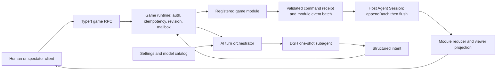

# Agent Note: DeepSeek Useless AI 游戏平台

Status: proposed

[English](2026-08-21-deepseek-useless-game-platform.md) | 中文

## 问题

DeepSeek Harness 已经具备 Agent、one-shot 与 continuable Subagent、持久会话、模型路由、设置、Typert RPC 和浏览器客户端，但当前仍按通用 Agent 与编码产品装配。DeepSeek Useless 需要保留 DSH-X 的 `model-hub` 与飞书通道，同时通过产品 profile 隔离终端、编码、写作和编辑器能力；飞书先作为可选源码保留，后续再接入同一套游戏命令与投影服务。

首个游戏是狼人杀。它的确定性阶段 1 内核已经包含规则定义注册、持久事件、回放、合法动作、种子随机、胜负判定与各 Bot 连续性状态。平台必须保留这份在研成果，同时能容纳纸牌与 DND 类游戏；这些游戏在调度、隐藏信息、响应打断、叙事与战役模型上有明显差异。

模型不能成为游戏规则或状态的权威。模型输出可能不完整、格式错误、自相矛盾，也可能被秘密信息污染；真人客户端同样不可信。服务端必须校验每条命令、串行化并发变更、记录所有已接受结果，并且只投影某位玩家或观战者有权观察的信息。

## 方案

在现有 Cordis 插件运行时上，把 DeepSeek Useless 构建为两个协作平面：

- **游戏平面**是确定性的服务端权威命令/事件运行时。每个游戏模块自行拥有规则、事件词汇、reducer、合法动作、调度器、胜负或结束条件以及按观察者裁剪的投影。
- **AI 平面**复用 DSH 的 Agent、Subagent、会话、模型路由、设置与用量统计。它接收为单个座位准备的投影，返回结构化意图，再把该意图提交到与真人客户端相同的命令路径。

通用游戏能力刻意不定义统一的阶段、回合、角色、卡牌、遭遇或战役。这些概念属于具体游戏模块。通用能力只负责实例绑定、命令准入、修订与幂等校验、单写者执行、模块定位、投影交付以及 AI 决策桥接。

产品先以本地优先、单 Node.js 进程的 Web 应用起步。专用 `game` profile 与 bundle 选择产品依赖闭包。在游戏 profile 通过验收之前，现有包仍保留在仓库；只有装配证明确实不需要某个包后，才执行源码删除。

## 设计目标与非目标

### 目标

- 支持真人、AI 与观战席混合，并按座位控制可见信息。
- 支持顺序回合、同时提交的隐藏行动屏障、响应窗口与自由叙事意图，而不强迫它们共用一种调度器。
- 仅依靠持久事件回放、恢复与 fork 游戏，不重复模型调用或随机抽取。
- 继续使用现有 provider/model 设置体系管理模型配置与各座位选模。
- 通过注册模块和 UI renderer 增加游戏，不修改 `agent-loop` 或平台命令执行器。
- 先通过 bundle 装配移除无关产品能力，再删除源码包。

### 非目标

- 高频物理、动作战斗、锁步模拟或客户端权威玩法。
- 首版即支持分布式匹配、多地域房间或游戏实例横向迁移。
- 设计能够表达一切游戏规则的通用声明式语言。
- 直接交付专有 DND 世界观或规则书内容；内容包需要独立许可评审。
- 初始化阶段就重命名全部上游包、npm scope、可执行文件或 DSH 持久化格式。

## 当前基线与调研结论

DSH-X 无需替换核心即可支撑该方向。已复核的 DSH-X `docs/architecture.md` 把 Cordis 装配、持久会话事件、Agent 作用域以及按 provider 路由的 LLM adapter 定义为明确扩展点；DSH-X 的 `model-hub` 提供 provider/model 编排与降级，飞书通道已经具备独立桥接、身份 allowlist 和卡片更新路径。已复核的 `packages/subagent/subagent/src/types.ts` 支持 one-shot、选模、工具过滤、取消与持久子节点身份。`D:\dev\DSH-X-werewolf` 已实现的狼人杀内核证明了确定性折叠与随机结果记录，其修订后的 configurable-mode 提案继续负责 Bot runner、运行时 API、投影与 UI 交付。这些都是源码快照引用，不会复制进当前仅保存设计的目录。

### Fork 基线

官方 `dsh-v0.1.0-rc.8` 只作为上游兼容与差异审计基线，不作为 DeepSeek Useless 的实现分支起点。实现分支从一个精确的 DSH-X 集成提交创建：狼人杀模式全部完成，当前 DSH-X 主线已经合入，`model-hub` 与飞书能力保留，工作树干净且由固定提交或标签标识。当前 `D:\dev\dsh-u` 只保存设计成果，不是最终实现基线；该冻结提交出现前不从任何本地分支同步游戏代码。

冻结提交必须满足以下条件：

- 狼人杀确定性核心、one-shot Bot 运行器、Session 控制器、真人投影、类型化 RPC、专用 Web 视图、`quick-7` 无密钥快照、暂停/恢复、回放和 fork 验收全部完成。
- 狼人杀阶段 3 按本文的实例归属、批次追加、调用方身份和 AI provider 约定收口，避免 fork 后同时保留狼人杀专用控制器与通用游戏控制器。
- DSH-X 主线上的 `model-hub`、飞书修复及其他 fork 自有提交已经集成，冲突由实际语义解决；源分支与集成工作树均无未提交文件。
- 聚焦游戏测试、类型检查、构建、hygiene、文档门禁和组装产品快照通过；最终 fork 文档记录精确提交或标签，不使用浮动分支名。

本轮把外部游戏框架作为模式参考，而不直接选为依赖：

| 来源 | 有用证据 | 本项目决策 |
|---|---|---|
| [boardgame.io concepts](https://boardgame.io/documentation/) | 纯 move 以及分离的 phase、turn、玩家 stage 能让规则转换保持显式。 | 保持模块 reducer 与调度器纯函数；不把其 phase 模型强加给 DND 类游戏。 |
| [boardgame.io secret state](https://github.com/boardgameio/boardgame.io/blob/main/docs/documentation/secret-state.md) | 秘密数据必须在传输前移除，而不只是由 UI 隐藏。 | 让 `project(state, viewer)` 成为浏览器与模型观察的唯一来源。 |
| [boardgame.io randomness](https://github.com/boardgameio/boardgame.io/blob/main/docs/documentation/random.md) | 服务端持有的确定性随机既支持回放，也防止客户端预测随机流。 | 在命令求值时注入随机，并把结果或求值后的 RNG 状态写入持久事件。 |
| [XState actors](https://stately.ai/docs/actors) | Actor 每次只处理私有 mailbox 中的一条消息，通过消息或 snapshot 暴露状态。 | 每个游戏实例只设一个串行命令 mailbox；现有 reducer 足够时不引入 XState。 |
| [Colyseus rooms and state](https://docs.colyseus.io/room) | Room 隔离游戏会话，由服务端负责变更与生命周期。 | 把每局视作隔离的服务端权威运行时，但首版复用 DSH RPC 与事件交付。 |
| [Colyseus StateView](https://0-16-x.docs.colyseus.io/state/view) | 按客户端生成 state view 是处理隐藏信息的一等机制。 | 在序列化前显式生成玩家、队伍、GM 与观战投影。 |
| [DND SRD 5.2.1](https://www.dndbeyond.com/srd) | SRD 内容可按 CC-BY-4.0 使用并要求署名，但未收录的世界观与名称并未授权。 | 规则内容与引擎分离并带版本；DND 兼容内容包发布前选定 SRD 版本并落实署名。 |

首版不引入 boardgame.io、XState 或 Colyseus。它们会重复 DSH 既有职责，或迫使当前狼人杀代码进入第二套运行时；其纯函数、保密、随机、Actor 与 Room 模式仍作为验收参考。如果未来实测出现高并发实时房间需求，可把 Colyseus 作为传输 provider，而不改游戏模块。

## 运行时架构



### 游戏运行时

`ctx.games` 是平台 Service Definition。默认 provider 把一个游戏实例绑定到一个专用的 DSH host Agent 及其 Session，按精确 id 与版本解析已注册模块，对该实例串行执行命令，追加已接受的模块事件，通过模块 reducer 重建状态，并发出投影失效通知。一个 host Session 只拥有一局游戏；“再来一局”创建新的 Agent/Session，并以显式 lineage 关联上一局。普通游戏 RPC 不向 host Agent 的聊天 inbox 投递消息；这个闲置 Agent 只提供生命周期、父子会话归属、模型/预设作用域以及调用 Subagent 所需的明确 `parent`。浏览器或 AI runner 永远不会收到原始状态或原始会话日志。

第一条持久事件把 host Session 绑定到 `{ gameId, moduleId, moduleVersion, rulesId, rulesVersion }`。每个游戏模块继续通过 `SessionEventMap` 声明合并拥有自己的持久事件类型；平台不把模块事件塞入不透明的通用载荷。每个已接受命令批次另带一个公共的 `game/command-committed` 收据事件，记录精确模块身份、`requestId`、规范化命令摘要、前后修订和模块事件数。它让运行时独立重建幂等索引，也能记录没有产生模块事件的已接受 no-op；具体领域事件仍由所属模块校验与折叠。

### 游戏模块

注册接口在可信同进程内使用泛型，在持久化、RPC 与模型边界使用 JSON 校验。概念接口如下：

```text
GameModule<State, CreateInput, Command, Event, View> {
  identity: { id, version }
  parseCreate(json): CreateInput
  create(input, { entropy, now }): Event[]
  parseCommand(json): Command
  transition(state, command, { actor, now }): Event[]
  ownsEvent(event): boolean
  reduce(state | undefined, event): State
  revision(state): number
  project(state, viewer): View
  pendingDecisions(state): PendingDecision[]
  prepareAiTurn(state, decision): {
    observation, outputSchema, parseResult
  }
  deadlines?(state): Deadline[]
  fork?(state, { parentRevision, entropy, now }): Event[]
  status(state): waiting | running | paused | ended
}
```

`transition` 与 `reduce` 都是纯函数。运行时注入可测试的接收时间；模块只在创建新实例或可玩 fork 时接收新服务端 entropy，后续随机由模块自己保存在事件中的确定性流推进。模型、网络和计时器留在转换之外。运行时先在影子状态上解析、折叠并检查整个候选批次，再把模块事件与收据作为一个批次提交；即使 `transition` 返回空数组，收据也会持久记录这次已接受请求。活跃游戏的模块版本不可变；缺少该版本时恢复应直接失败，不能静默套用新规则。

`pendingDecisions` 返回稳定的 `{ decisionKey, actorId, sourceRevision, windowId, mode }` 描述；`mode` 只区分当前允许独占处理还是并行收集，不引入通用阶段语法。狼人杀公开座位顺序与夜间屏障、纸牌优先权/响应窗口以及 DND GM 仲裁都能用模块自己的状态产生这些描述。真人操作描述属于授权 `View`，AI 合法动作只存在于 `prepareAiTurn` 返回的观察和 schema 中，避免 `legalActions`、UI 投影与 AI schema 成为三份可能漂移的真相。

### 狼人杀适配结论

现有狼人杀核心无需重写。规则集与定义注册表、类型化事件、单一 reducer、封闭动作规格、已记录随机流、Bot 连续性、`buildWerewolfBotRequests()`、观察投影和 one-shot runner 都保留；通用层只增加适配器和实例生命周期。

Fork 前需要调整狼人杀阶段 3 的脚手架：

- `ctx.werewolf` 继续拥有规则定义、编译器、引擎和 Bot 策略；Session 绑定、mailbox、幂等、RPC、投影失效和 AI 调度统一由 `ctx.games` 持有，不能再实现一套并行控制器。
- 当前“一个普通父 Session 可依次开始多局游戏”的设计改为“一局一个专用 host Agent/Session”；现有日志事件仍保持类型和 reducer 语义，新一局通过 lineage 关联。
- `buildWerewolfBotRequests()` 适配为 `pendingDecisions()`；`projectWerewolfBotObservation()` 与 `werewolfEnvelopeSchema()` 适配为 `prepareAiTurn()`。狼人杀的阶段、角色、动作规格和上下文 delta 不上移到通用包。
- 阶段 3 不能继续把一次 `Session.append()` 描述为多事件事务。狼人杀引擎步骤已经可能产生多个事件，通用收据还会再增加一个事件；它们必须通过真正的 `appendBatch()` 一起接纳。
- Bot provider 准入在现有 output schema、persona、tool filter 与深度检查之外，还必须断言 `inheritsParentContext === false`。默认模型可以继承 host Agent 的 `model-hub` 路由，但平台同时提供按游戏和座位覆盖。
- 真人投影接口接收运行时解析出的 viewer/actor binding。MVP 仍只有一名本地真人，但领域接口不再从 `sessionId` 隐式推断唯一玩家，以便 Web、飞书和未来远程客户端复用同一路径。

### UI 与传输

首版产品 UI 复用 Web Client 的 Session 生命周期，注册通用游戏壳与按 key 分发的模块 renderer。大厅与实例命令使用类型化 Typert remote。入口适配器把 Web 本地身份或未来飞书 `open_id` 解析为平台 principal，运行时再从游戏参与者绑定得到 viewer/actor；模块和客户端都不能直接信任调用方自报的座位。普通游戏操作绕过父 Chat 模型。公开桌聊、私聊与 DND 叙事意图都是领域命令和持久游戏事件，而不是未记录的 UI 状态。

通用外壳负责大厅导航、座位、准备状态、连接状态、计时器、可访问性、模型标识、用量与回放控制。模块 renderer 分别负责狼人杀桌面、卡牌区域与响应窗口，或 DND 场景、角色卡、地图与骰子展示。

## 权威命令与事件流

1. 外部调用方通过类型化 RPC 提交 `{ gameId, requestId, expectedGameRevision, command }`；AI、计时器和恢复任务使用运行时签发的内部 actor capability 提交同一命令信封。
2. 运行时认证 principal 并从参与者绑定解析座位、GM 或观战能力；同一 `requestId` 若内容不同则拒绝，`expectedGameRevision` 过期也拒绝。外部载荷中的任何 actor/viewer 提示都不能覆盖该绑定。
3. 每局 mailbox 每次只执行一条命令。模块解析命令，依据权威状态检查合法动作，并返回零个或多个事件；运行时在影子状态上预先验证完整批次、修订单调性和模块不变量。
4. 运行时调用阶段 1 新增的 `Session.appendBatch()`，一次性把公共收据和模块事件接纳进 host Session，再立即调用 `ctx.sessions.flush()` 作为持久性屏障。
5. 只有 flush 成功且至少有一个持久化 listener 参与后，运行时才更新服务中的已发布状态、分别计算观察者投影并发出失效元数据。没有持久化 provider 或 flush 失败会隔离该实例、拒绝后续命令且不确认本次请求，直到同一屏障重试成功或实例从持久日志恢复。
6. 计时器、AI 回合与重连恢复都从相同路径提交命令，不能直接改状态。

已复核的 DSH-X `Session.append()` 每次只接纳一个事件，并不满足以上批次语义。阶段 1 必须在 `packages/core/session` 增加 `appendBatch()`：先对全部候选数据、序号和 surface 转换做快照与验证，再一次更新内存日志，最后按顺序发布 observer 通知。该实现不能循环调用 `append()`；当前 invariant companion 会按事件暂存 fold，因此批次 API 还必须提供提交前的整批 invariant 预检，让同一候选序列在一个影子 fold 上验证，任一事件失败时日志、surface 与 invariant 状态都不改变。提交成功后可继续按顺序发出兼容的 `session/event` observer 通知。现有 persistence seam 已把连续事件数组作为一个耐久批次追加；`game` bundle 固定装配一个持久化 provider，并在每个命令后跨过 flush 屏障。未交付这项 seam 之前，平台基础阶段不能宣称具备命令原子性。接受事件之后必须执行的副作用采用 outbox 风格，与事件同批记录任务，再单独确认完成。

## AI 编排

每个逻辑 AI 座位都有由模块拥有的连续性数据，并与权威事实分离。当 AI 需要行动时，orchestrator 向模块索取一个座位范围内的观察与允许的结构化意图 schema，通过 `model-hub` 依次解析座位覆盖、游戏默认和 host Agent 默认路由，再以专用 host Agent 作为 `parent` 调用配置的 one-shot provider。运行时检查 provider 的 `inheritsParentContext === false`，并要求其支持 `outputSchema`、`toolFilter`、persona、深度限制与取消。实际 provider/model 与尝试结果记录在 child Session；回放只使用已经接受的游戏事件，不重新解析当前模型配置。

`spawn` 子节点拥有自己的 Session，并只收到该座位的投影、自己的连续性检查点、当前动作所需的规则帮助与受限工具集；它记录 host Session 的父子归属，但不会像 `fork` provider 那样继承父会话历史。子节点不能收到原始父 Session、其他座位私密状态、凭证、文件系统工具或 Shell 工具。返回 JSON 一律视为不可信：模块先解析，运行时再走普通准入路径提交，只有接受的命令才能更新连续性。

默认选择 one-shot 而不是长生命周期模型对话，因为回放与恢复应依赖已记录的观察与连续性，而不是 provider 专有的隐藏历史。阶段 4 的 DND 验证也固定使用 fresh `spawn`：模块为每次 GM/NPC 决策重建完整的可见场景、私密事实和显式连续性，并把已接受的叙事或裁决结果写入游戏事件。

Continuable Subagent 不属于阶段 1 至 4 的依赖。若后续独立设计批准使用，`game-agent` 而不是游戏模块持有 `{ gameId, logicalActorId } -> childSessionId` 映射，通过 `startContinuable()`、`followup()`、`interrupt()` 和 drain API 管理生命周期；其 child Session 仍以 host Agent Session 为父，模块只提供投影和连续性数据，不接触内部 Activation 句柄。

通用 AI runner 只负责 provider 调用、能力检查、取消、并发预算和 child Session 证据；模块拥有 prompt/schema、结果解析、重试诊断的安全内容、兜底动作、暂停行为以及真人接管规则。现有狼人杀 runner 通过这些回调接入，不把狼人杀上下文 delta 或托管动作词汇搬进通用包。模型失败是一种玩法状态，不构成绕过规则的理由；失败与兜底决策按适当保密级别持久化并出现在回放中。

## 对目标游戏类型的支持

| 需要 | 狼人杀 | 纸牌游戏 | DND 类游戏 |
|---|---|---|---|
| 调度器 | 公开座位顺序，加同时提交的夜间隐藏行动屏障。 | 独占回合、堆栈或响应窗口，以及需要时的同时选择。 | 场景、探索、遭遇、休整与由 GM 控制的自由转换。 |
| 隐藏信息 | 角色、阵营、夜间行动与私密通知。 | 手牌、牌库、暗置区域、队伍知识与延迟观战。 | GM 私密笔记、战争迷雾、陷阱、NPC 动机与角色私密事实。 |
| 随机 | 记录角色分配、平票裁决与档案分配。 | 服务端洗牌、抽牌、骰子与随机目标。 | 记录骰子、遭遇表、战利品与程序生成结果。 |
| AI 单元 | 每个座位一个逻辑 Bot，并持有受限主观连续性。 | 座位 Bot，加可选的搜索或模拟 worker。 | GM/director、玩家角色，以及临时 NPC 或规则 worker。 |
| 合法意图 | 封闭的目标、选项、文本与复合动作规格。 | 卡牌、区域、目标、费用、优先权与 pass 意图。 | 结构化规则动作，加由解释 Agent 转成已校验命令的文本意图。 |
| 结束条件 | 阵营胜利或平局。 | 分数、淘汰、目标、牌库或认输条件。 | 场景或战役里程碑；战役可以保持开放。 |

共享运行时不直接处理表中任何游戏规则。纸牌框架可以增加可复用的牌库、区域、费用与响应窗口插件；DND 框架可以增加场景、实体、骰子、规则内容与 GM 仲裁插件。GM 的自由文本只能形成结构化裁决提案，模块校验并提交后才成为事实；回放使用已记录结果，不重复调用模型。二者都只是相同命令、事件、投影与 AI 接缝之后的普通游戏模块。

## 持久化、保密与并发

- 首版以 host Session 日志为权威来源。游戏事件保持 log-only；只有模块明确把观察渲染进子 Session 时，它才进入模型面。
- 每份模型可见观察都记录在真正发起请求的子 Session 中，维持 DSH 的“模型可见输入必须可重建”规则。
- 观察者投影属于安全操作。每个模块必须提供覆盖所有 viewer 能力的秘密 fixture、字段排除断言、跨座位 prompt 快照，以及非干扰测试：另一个座位的秘密状态变化不应改变未授权观察者的投影，除非它同时产生了刻意公开的元数据。这是运行时覆盖门禁，不宣称 TypeScript 能静态证明任意未来模块永不泄密。
- 首版原始本地存储含有全部权威秘密，能够支持回放，但不能防止管理员直接读取文件；加密与托管环境的对抗性存储属于独立里程碑。
- 每个游戏实例只有一个进程内 mailbox 拥有变更权。`expectedGameRevision` 防止过期写入，`requestId` 保证重试幂等。
- 随机由服务端提供。Reducer 不调用环境随机；持久事件保存结果或确定性随机流的下一状态。
- 可玩的游戏分支不是对父 Session 做原始 seed fork。运行时先把父游戏折叠到选定修订，再创建新的 host Agent/Session，并记录父游戏身份、fork 修订和新生成的服务端 entropy；模块据此产生子游戏 genesis 事件。因此子分支未来随机默认不同，但自己的回放稳定。保留父随机状态只用于显式的只读诊断克隆。
- Deadline 是持久时间戳。恢复时，scheduler 以稳定的 `timeout:<deadlineId>` request id 通过普通命令补交一次已过期 timeout，不能重复结算。

## DSH 能力保留与裁剪

| 分类 | 能力 | 处理方式 |
|---|---|---|
| 产品运行时 | Cordis loader/effect、agent 与 agent-loop、tools 与 system prompt、session 与 projection、subagent 注册表和 `spawn` 进程内 provider、LLM adapter、DSH-X `model-hub`、settings 与 credentials、Typert RPC、Web host/client、storage 与 runtime invariant。 | 保留，只通过 `game` bundle/profile 暴露；ToolRuntime 只服务结构化输出捕获和经审计的 AI 辅助工具，游戏规则动作不建模为模型工具。 |
| 产品可选 | 飞书 channel/bridge、Attachment、Skill、Web Search、Command、用量遥测、job/schedule、桌面壳、continuable Subagent。 | 保留源码。飞书后续以独立入口 overlay 接入同一 principal、命令与投影服务；其他能力只有出现已确认用例时才装配。 |
| 仅开发使用 | FileSystem、subprocess、Shell、Terminal、MCP、LSP、code runtime、self-modification、hooks、ACP、workflow、plan/goal/todo 与编码预设。 | 不装入交付的 game profile；开发 fork 期间留在 maintainer profile。 |
| 后续删除 | Writing/UEd、E2B、无用 examples、仅编码使用的客户端面板，以及被 game、game-feishu 与 maintainer profile 都证明不可达的包。 | 依赖、构建、回放和包门禁均通过后再删除。飞书不属于本轮裁剪候选。 |

首个裁剪单元是 bundle row，而不是源码目录。物理删除按以下顺序执行：移除装配和 preset 引用，证明产品与 maintainer 依赖闭包，从 apps/examples/docs 清除包引用，删除包，重新生成锁文件与目录，最后运行聚焦测试和仓库门禁。

`game` 是独立最小 bundle，不把 `base` 或 `web-app` 列为父 bundle。它直接声明 Session、持久化、Agent、Subagent spawn、LLM/model hub、settings、Typert、Web host/connection 与游戏 UI 所需依赖和 patch 行。现有 `base`/`web-app` 只留在 maintainer profile。基础 Web 产品默认不挂载飞书；未来 `game-feishu` overlay 复用现有 channel/bridge 并增加游戏入口适配器，不能把普通飞书消息直接当成隐藏信息游戏命令。首版允许无关源码包仍因 monorepo 安装存在于 `node_modules`，但产品运行时不得挂载或注册它们；物理依赖裁剪属于阶段 5。

## 拟议包结构

| 路径 | 职责 |
|---|---|
| `packages/game/game/` | 首版完整能力包：`ctx.games` Service Definition、默认单进程 provider、品牌化 id、模块注册表、实例/参与者绑定、串行 mailbox、Session 批次提交、投影失效、deadline 对账，以及 one-shot AI 调用的通用内部模块。 |
| `packages/game/werewolf/` 与 `werewolf-classic/` | 现有确定性引擎与经典定义；适配通用模块接口，但不削弱其类型化事件或不变量。 |
| `packages/game/cards/` | 可复用的卡牌、牌库、区域、费用、目标、洗牌与响应窗口原语；它本身不是完整游戏。 |
| `packages/game/dnd/` | 场景、实体、骰子、规则内容与 GM 仲裁原语，并支持带版本的内容包。 |
| `packages/client/ui-game/` | 大厅、通用房间壳、观察者寻址、回放控制与 keyed game-renderer 注册表。 |
| `packages/client/ui-werewolf/`、`ui-cards-*`、`ui-dnd/` | 各模块专用的交互与展示。 |
| `packages/bundle/game/` | 最小产品装配与 `game` profile 依赖。 |
| `packages/channel/feishu-game/`（后续） | 把飞书 principal、交互卡片与消息映射到 `ctx.games`；只消费授权投影，不读取原始游戏 Session。 |
| `examples/game-*` | 无密钥脚本 provider、确定性 fixture、回放输入与产品快照。 |

阶段 1 不创建 `game-session-runtime` 或 `game-agent` 独立包。只有出现第二个 provider、continuable 生命周期或独立发布需求，使 Service Definition、Provider 或 Consumer 确实独立演进时才拆分。卡牌与 DND 原语同样在第二个真实消费者出现后提取。

## 交付阶段

阶段 1 只在前述 DSH-X 冻结提交形成并据此创建实现分支后开始。

1. **平台基础：**在单个 `packages/game/game` 包中增加完整能力 seam、模块注册表、专用 host Agent/Session 与参与者绑定、`Session.appendBatch()` 及整批 invariant 预检、flush 门禁、串行命令路径、观察者投影约定、`model-hub` 座位路由，以及不继承 `base/web-app` 的最小 `game` bundle/profile；适配当前狼人杀内核，不改变其玩法规则。
2. **可玩的狼人杀：**完成现有 Bot runner、运行时方法、投影、类型化 remote、专用 Web 视图、脚本化无密钥 provider、回放 fixture，以及“一名真人加 AI”端到端快照。
3. **纸牌证明：**实现一款小型隐藏手牌游戏，覆盖洗牌、抽牌、合法目标、响应/pass、私密投影、回放与 AI 座位；只提取实际出现两次的纸牌原语。
4. **DND 类证明：**实现一个简短的 SRD 兼容场景，包含一名真人、one-shot GM Agent、至少一个 one-shot NPC worker、已记录骰子、GM 私密事实与可恢复叙事状态；每次调用从事件与显式连续性重建完整上下文，不依赖 continuable child。
5. **产品裁剪：**测量 game profile 闭包，移除无用装配行，再以小批次删除不可达包，同时保留 maintainer profile。
6. **托管多人：**本地产品稳定后再增加认证、房间发现、远程真人座位、重连宽限、配额、滥用控制与适合托管并发的存储 provider。

## 待确认决策

- 拟议 MVP 是“一名本地真人加多个 AI 座位”，远程多真人房间后置。若首版就选择远程多真人，会新增认证、座位预留、重连、滥用和秘密传输范围。
- 飞书保留已确定；是否把飞书入口纳入首次可玩狼人杀里程碑仍未确定。默认计划是在 Web MVP 通过后实现 `game-feishu` overlay，避免把移动端卡片交互变成阶段 1 阻塞项。
- 拟议 DND 验证使用明确带版本的 SRD 兼容规则包，不使用 Forgotten Realms 或其他非 SRD 世界观内容。实现前必须选定确切 SRD 版本与署名文本。
- 已将用户提供的品牌板保存到 [`docs/assets/deepseek-useless/logo-board.png`](../../../../docs/assets/deepseek-useless/logo-board.png)。生产图标、透明底标记、favicon 尺寸以及公开使用 DeepSeek 名称需要独立的品牌导出与法务决定。
- 产品展示名使用 `DeepSeek Useless`，仓库 slug 使用 `dsh-u`，本地分支使用 `feat/deepseek-useless`；npm scope 与可执行文件重命名等产品 bundle 出现后再决定。

## 备选方案

**立即删除无关包。**拒绝，因为 bundle 装配已经提供可逆的产品边界；过早删除会把架构工作与依赖考古混在一起，也会增加保留在研狼人杀分支的难度。

**把狼人杀阶段模型作为通用游戏引擎。**拒绝，因为纸牌响应窗口与开放式 DND 场景不存在一个有用的统一 phase 语法。公共层应标准化命令、事件、投影与 AI 准入。

**以 boardgame.io 作为平台核心。**首版拒绝，因为它会与 DSH Session、多人传输、插件和回放重复，并要求重写当前狼人杀引擎；但保留其纯函数、保密、随机和日志模式作为设计证据。

**每个游戏实例都使用 XState。**暂不采用，直到嵌套或可打断状态的复杂度证明现有 reducer 与模块调度器不足；无论使用哪种状态机库，串行 mailbox 都仍然需要。

**立即采用 Colyseus。**拒绝，因为首版是回合制、本地优先，且已有 Typert RPC 和 Session 事件。以后可以增加传输 provider，而无需修改游戏模块。

**让父模型充当法官或 GM 权威。**拒绝，因为这会让合法性、保密与回放依赖非确定性输出。模型负责提出意图与叙事，可信模块负责提交事实。

**每个 AI 座位保留一段长生命周期模型对话。**不作为默认方案，因为 provider 历史会变成隐式状态库。one-shot 加显式连续性更便于恢复、回放、切换模型与隐私评审。

## 验收标准

- 游戏模块可按精确 id/version 注册与加载，不修改 `agent-loop`。
- 实现分支来自满足 fork 门禁的精确 DSH-X 冻结提交；官方 rc8 仅作为上游比较基线。
- `Session.appendBatch()` 的故障注入测试证明整批接纳前先完整验证；同一修订上的两条命令不能同时提交，重试同一 `requestId` 不会产生重复模块事件或收据。
- 批次 invariant 测试证明第二个或更后事件失败时，Session 日志、surface、模块 fold 与发布投影全部保持在提交前状态。
- 回放一个 host Session 能得到相同权威状态和观察者投影，不调用模型，也不产生新随机。
- 每个模块的 viewer 矩阵、秘密 fixture、非干扰断言与 prompt 快照均通过，未授权浏览器或 AI prompt 不包含其他座位的角色、手牌、私密通知或 GM 事实。
- 真人与 AI 动作走同一解析、合法性校验、修订校验与事件追加路径。
- 狼人杀 quick-7 能通过脚本化无密钥 AI provider 完成整局、暂停恢复，并生成稳定回放快照。
- 纸牌验证与 DND 类验证共用同一平台运行时，且运行时中不新增具体游戏分支。
- 每局使用独立 host Agent/Session；再次开局创建新实例，外部调用方不能通过伪造 actor/viewer 越过参与者绑定。
- AI provider 必须声明 `inheritsParentContext === false`，座位/游戏模型覆盖通过 `model-hub` 解析，并在 child Session 留下实际 provider/model 证据。
- 基础 `game` profile 启动运行时不挂载 Terminal、Writing、飞书、LSP、MCP、E2B、code runtime 或编码 preset；可选 `game-feishu` overlay 单独验收身份映射、卡片操作与秘密投影。
- DND 验证只用 fresh `spawn` one-shot；任何 continuable 路径均未装配，除非另有已批准的生命周期与隐私设计。
- 每个交付阶段的聚焦包测试、typecheck、build、hygiene、文档门禁与产品快照全部通过。

## 风险

- 在第二款游戏前泛化，容易形成只符合狼人杀的抽象。纸牌验证是提取门槛：同一不变量未被两个模块需要前，不把类型移入公共包。
- 把全部权威秘密放入 host Session 只符合当前本地威胁模型。托管玩法需要加密存储、严格服务端授权、日志访问策略与不会泄密的诊断。
- DND 战役可能超过单个 Session 的合理规模。Checkpoint、战役与场景分界、归档存储应在 DND 验证中实测，不能藏在无限增长日志之后。
- AI 成本与延迟随座位和重试增长。运行时需要单局预算、并发决策上限、取消，以及确定性兜底或暂停策略。
- 即使产品 profile 能启动，物理裁剪源码仍可能破坏 examples、生成目录、preset 和发布包图。删除必须作为独立的分阶段简化，并运行仓库级门禁。
- DeepSeek 与 DND 名称、Logo 以及非 SRD 内容涉及超出本技术设计的商标与内容许可风险。
