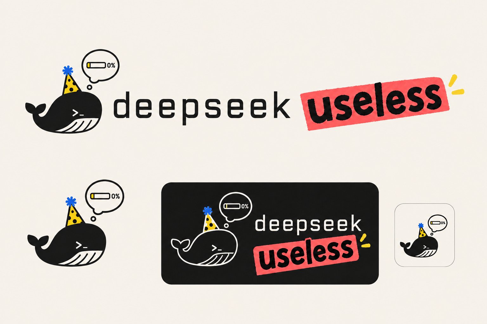

# DeepSeek Useless

DeepSeek Useless 是一个基于 DSH-X 核心能力设计的 AI 游戏平台，目标是在同一底座上承载狼人杀、纸牌与 DND 类游戏。当前目录是设计占位仓库，已移除继承来的 DSH 源码，不是可构建或可运行版本。

## 当前状态

- 本轮只完成目录清理、技术调研、架构设计、狼人杀阶段 3 方案调整与独立评审。
- 没有拉取、同步或复制任何实现代码，没有操作 GitHub、远端分支、提交或发布。
- 官方 `dsh-v0.1.0-rc.8` 只作为兼容与差异审计基线，不作为项目实现分支起点。
- 最终实现应等待狼人杀模式完成，再把当时的 DSH-X 主线按语义集成进来，保留 `model-hub` 与飞书能力，并从一个精确、干净、有提交或标签标识的集成点创建新分支。

## 已确定的游戏底座

- `ctx.games` 统一持有游戏实例、专用 Host Agent/Session、命令 mailbox、幂等、身份绑定、原子批次、投影失效与 AI 调度。
- 每局游戏只对应一个专用 Host Agent/Session；“再来一局”和可玩 fork 都创建新实例并记录 lineage。
- `Session.appendBatch()` 必须对命令收据与领域事件做同一影子 fold 的整批预检，任一候选失败时日志、surface、不变量与游戏修订都不改变。
- 游戏模块只持有自身规则、命令、事件、reducer、观察者投影和 AI 决策适配，不共享统一的 phase、turn 或 round 语法。
- `model-hub` 按座位覆盖、游戏默认、Host 默认的顺序解析模型；AI 子 Session 必须使用 `inheritsParentContext === false` 并记录实际路由与模型。
- Web 身份和未来飞书 `open_id` 都先映射为平台主体，再解析为游戏参与者；客户端不能自报 Host Session 或座位。
- 首版通用能力集中在一个 `packages/game/game/` 包中，等第二款游戏证明真实复用边界后再拆包。

狼人杀阶段 1–2 的规则注册、确定性引擎、事件、reducer、随机流、投影、Bot 连续性和 one-shot runner 保持不变。阶段 3 改为增加薄适配器接入 `ctx.games`，不再创建狼人杀专用的并行控制器。

## 设计文档

- [平台架构方案（中文）](.agents/notes/proposed/feature/2026-08-21-deepseek-useless-game-platform.zh.md)
- [Platform architecture proposal (English)](.agents/notes/proposed/feature/2026-08-21-deepseek-useless-game-platform.md)
- [架构与狼人杀脚手架评审（中文）](docs/deepseek-useless-architecture-review.zh.md)
- [Architecture and Werewolf scaffold review (English)](docs/deepseek-useless-architecture-review.md)
- 狼人杀阶段 3 的双语源提案位于 `D:\dev\DSH-X-werewolf\.agents\notes\proposed\feature\2026-08-20-configurable-werewolf-mode.*`。

## 开始实现前的门禁

1. 狼人杀阶段 3–5 完成，包含专用 Host Session、真人投影、类型化 RPC、专用 Web 视图、无密钥 `quick-7` 快照、暂停/恢复、回放与 fork 验收。
2. 狼人杀阶段 3 已按本方案完成 `ctx.games` 归属、批次原子性、平台主体绑定和 `model-hub` 接入。
3. 当前 DSH-X 主线与狼人杀分支完成语义集成，`model-hub` 和飞书保留，工作树干净。
4. 固定精确提交或标签后，再从该点创建 DeepSeek Useless 实现分支。

## 清理说明

2026-08-21 已把继承的 DSH 内容移出本项目目录，仅保留 `.git`、本说明、Logo、架构方案和评审文档。由于安全策略禁止永久递归删除，旧内容暂存于 `D:\soft\tmp\dsh-u-removed-20260821-final`，可恢复；它不属于当前项目目录。
